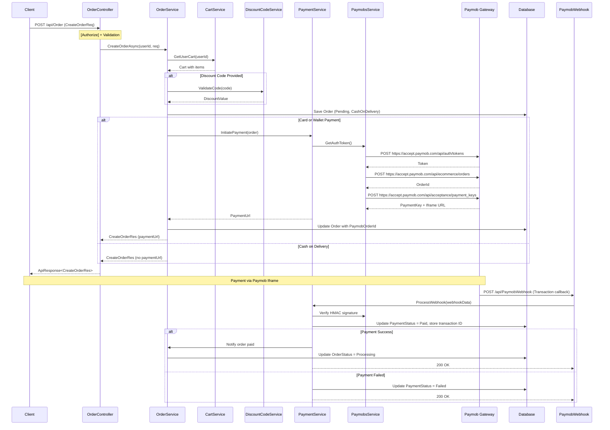
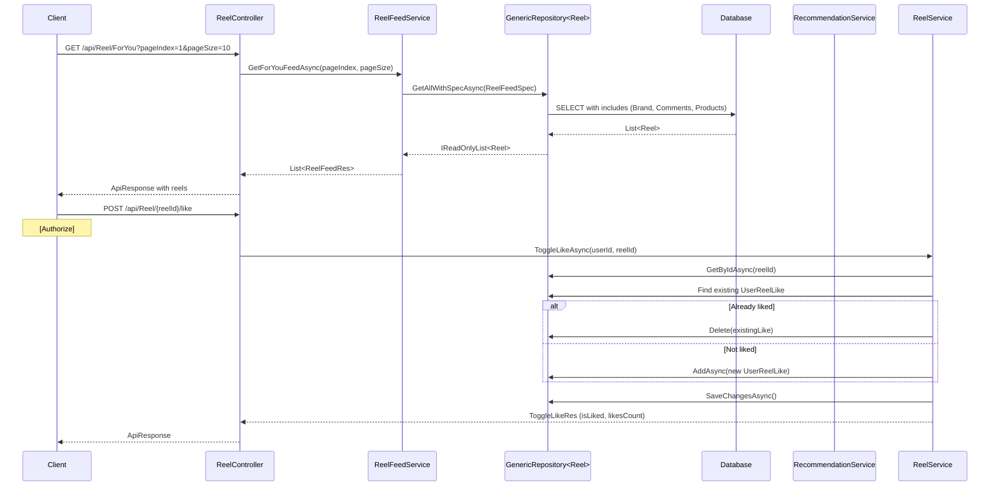
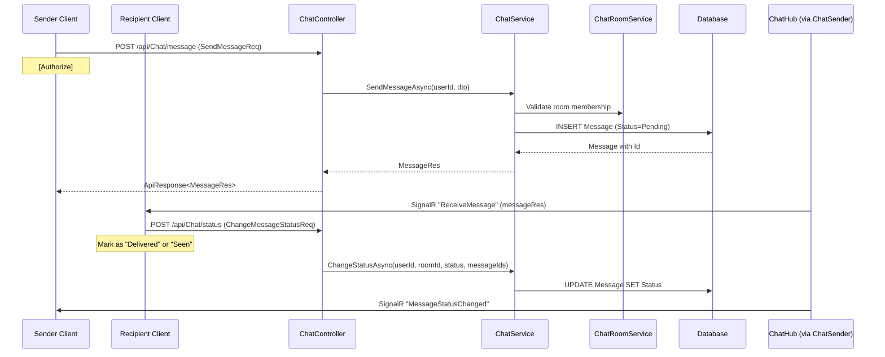

# API Design and Workflows

## 1. API Conventions

### 1.1 Base URL and Routing

All controllers inherit from `AppBaseController` (`Api/Controllers/AppBaseController.cs:5`), which applies:
```csharp
[Route("api/[controller]")]
[ApiController]
```
This convention ensures all endpoints follow the pattern `POST /api/{ControllerName}/{action}`. Attribute routing is used throughout for explicit path specification.

### 1.2 Standardised Response Format

Every API response follows the `ApiResponse<T>` envelope (`Shared/Responses/ApiResponse.cs`):

```json
{
  "success": true,
  "statusCode": 200,
  "message": {
    "en": "English message",
    "ar": "Arabic message"
  },
  "data": {},
  "errors": null
}
```

For paginated responses, `PaginationResponse<T>` extends this with a `Meta` block:
```json
{
  "success": true,
  "statusCode": 200,
  "data": [...],
  "meta": {
    "pageNumber": 1,
    "pageSize": 10,
    "totalRecords": 100,
    "hasPreviousPage": false,
    "hasNextPage": true
  }
}
```

### 1.3 Error Response Format

Validation errors use a per-field error format:
```json
{
  "success": false,
  "statusCode": 400,
  "message": { "en": "Validation failed", "ar": "..." },
  "errors": [
    { "field": "Email", "en": "Email is required", "ar": "..." }
  ]
}
```

## 2. Controller Inventory

The system exposes 34 controllers with the following summary:

| Controller | Base Route | Auth | Key Endpoints |
|---|---|---|---|
| `AuthController` | `api/Auth` | Mixed | Login, Register, CheckEmail, SignOut, UserInfo, ForgetPassword, ResetPassword, UserInterests |
| `AdminController` | `api/Admin` | None | Admin login |
| `BrandController` | `api/Brand` | Mixed | BrandInfo, BrandPolicy, Reviews, ToggleFollow, ToggleLike, CreateBrand, GetMyBrand, BrandStatus |
| `AdminBrandController` | `api/Admin/brand-requests` | None | GetPending, GetDetails, Approve, Reject, Ban |
| `BrandVerificationController` | `api/BrandVerification` | Authorize | VerifyBrand |
| `BrandProductController` | `api/BrandProduct` | Authorize | GetBrandProducts, AddProduct, UploadImages, PatchProduct, DeleteProduct |
| `ProductController` | `api/Product` | None | GetAll, GetById, GetRelatedProducts, GetRecommendations |
| `ReelController` | `api/Reel` | None | GetForYouFeed, GetFollowingFeed, GetReelById, ToggleLike, RecordView, Create, Delete |
| `ReelManagementController` | `api/ReelManagement` | Authorize | GetBrandReels, GetReel, Create, Update, Delete, AssignProducts |
| `ReelCommentController` | `api/ReelComment` | Authorize | GetComments, AddComment, DeleteComment |
| `CommentReplyController` | `api/CommentReply` | Authorize | GetReplies, AddReply, ToggleReplyLike |
| `CartController` | `api/Cart` | Authorize | GetCart, AddToCart, UpdateCart, ClearCart |
| `OrderController` | `api/Order` | Authorize | CreateOrder, GetOrders, GetOrderDetails, CancelOrder |
| `PaymentController` | `api/Payment` | Authorize | InitiatePayment, GetPaymentStatus |
| `PaymobWebhookController` | `api/PaymobWebhook` | None | TransactionCallback |
| `ChatController` | `api/Chat` | Authorize | GetRooms, GetMessages, SendMessage, CreateRoom, ChangeStatus, DeleteMessage, DeleteRoom |
| `CommunityController` | `api/Community` | Authorize | CreatePost, GetPost, GetPosts, EditPost, Delete, TogglePostLike, AddComment, DeleteComment, ToggleCommentLike |
| `NotificationController` | `api/Notification` | Authorize | GetNotifications, MarkAsRead, MarkAllAsRead, GetUnreadCount |
| `MediaController` | `api/Media` | Authorize | UploadVideo |
| `LookupController` | `api/Lookup` | None | GetCategories, GetBrands, GetInterests, GetRejectionReasons, GetColors, GetSizes |
| `SearchController` | `api/Search` | None | Search (products, brands, reels) |
| `TranslationController` | `api/Translation` | None | Translate (text) |
| `TodayOfferController` | `api/TodayOffer` | None | GetTodayOffers, GetRecentOffers |
| `DiscountCodesController` | `api/DiscountCodes` | Authorize | ValidateCode |
| `WishlistController` | `api/Wishlist` | Authorize | GetWishlist, AddToWishlist, RemoveFromWishlist, CheckInWishlist |
| `UserProfileController` | `api/UserProfile` | Authorize | GetProfile, UpdateProfile, UploadAvatar |
| `InterestController` | `api/Interest` | Authorize | GetInterests, SaveUserInterests |
| `OtpController` | `api/Otp` | None | SendOtp, VerifyOtp |
| `ContactUsController` | `api/ContactUs` | None | SubmitContactMessage |
| `ErrorController` | `api/Error` | None | NotFound, ExceptionHandlingTest |
| `GoogleAuthController` | `api/GoogleAuth` | None | Google OAuth callback |
| `TikTokAuthController` | `api/TikTokAuth` | None | TikTok OAuth callback |
| `TestRoomController` | `api/TestRoom` | None | Test endpoints |
| `TestNotificationController` | `api/TestNotification` | None | Test notification endpoints |

## 3. Complete Request/Response Flow

### 3.1 Authenticated Request Flow

```
Client → HTTPS Request
  → Kestrel (200MB request body limit configured)
    → SerilogRequestLogging (log request details)
      → ExceptionHandlingMiddleware.InvokeAsync()
        → HttpsRedirection (301 → HTTPS)
          → StaticFiles (check wwwroot)
            → AuthenticationMiddleware
              → JwtBearerHandler.AuthenticateAsync()
                → OnMessageReceived: Extract token from header or SignalR query
                → Validate token: issuer, audience, lifetime, signing key
                → OnTokenValidated: Check token blacklist
                → Set HttpContext.User with ClaimsPrincipal
              → AuthorizationMiddleware
                → [Authorize] attribute evaluated
                → User.Identity.IsAuthenticated check
              → CORS Middleware (AllowDevTunnel policy)
                → Endpoint Routing
                  → Controller Action Invocation
                    → ValidationActionFilter.OnActionExecuting (ModelState check)
                    → Action method executes
                      → Service → Repository → Database
                    → ValidationActionFilter.OnActionExecuted
                  → Action result formatted
                    → ApiResponse<T> serialized to JSON
                  → Response returned to client
```

### 3.2 Unauthenticated Error Flow

```
Client → Request to protected resource without JWT
  → JwtBearerHandler.AuthenticateAsync() → No token → NoResult
  → AuthorizationMiddleware → Challenge
  → JwtBearerHandler.OnChallenge:
    → Set 401 status code
    → Write ApiResponse<string>.ErrorResponse:
      {
        "success": false,
        "statusCode": 401,
        "message": {
          "en": "Unauthorized — please sign in to continue.",
          "ar": "غير مصرح — من فضلك سجّل الدخول عشان تكمل."
        }
      }
```

## 4. SignalR Real-Time Architecture

### 4.1 Hub Configuration

Two SignalR hubs are configured in `Program.cs`:
```csharp
app.MapHub<NotificationHub>("/notificationHub");
app.MapHub<ChatHub>("/chatHub");
```

JWT authentication is supported via query string for WebSocket connections:
```csharp
OnMessageReceived = context =>
{
    var accessToken = context.Request.Query["access_token"];
    if (!string.IsNullOrEmpty(accessToken) && 
        (path.StartsWithSegments("/chatHub") || path.StartsWithSegments("/notificationHub")))
    {
        context.Token = accessToken;
    }
}
```

### 4.2 Notification Hub

The `NotificationHub` handles real-time notification delivery. Senders push notifications through `INotificationRealtimeSender` → `NotificationRealtimeSender`:

```
Server event (e.g., order status change)
  → NotificationRealtimeSender.SendNotification(userId, notification)
    → NotificationHub.Clients.User(userId).SendAsync("ReceiveNotification", data)
```

### 4.3 Chat Hub

The `ChatHub` (`Api/SignalR/Hubs/ChatHub.cs`) manages real-time messaging, and `ChatSender` (`Api/SignalR/Senders/ChatSender.cs`) bridges the Application layer:

```
Message sent via REST
  → ChatService.SendMessageAsync()
    → ChatSender.SendMessage(recipientId, messageRes)
      → ChatHub.Clients.User(recipientId).SendAsync("ReceiveMessage", messageRes)

Room created via REST
  → ChatRoomService.CreateRoom()
    → ChatSender.RoomCreated(userId, roomRes)
      → ChatHub.Clients.User(userId).SendAsync("RoomCreated", roomRes)

Message status changed
  → ChangeMessageStatusService.ChangeStatusAsync()
    → ChatSender.MessageStatusChanged(userId, statusUpdate)
      → ChatHub.Clients.User(userId).SendAsync("MessageStatusChanged", statusUpdate)
```

## 5. Payment Workflow Sequence Diagram



## 6. Reel Feed and Interaction Sequence



## 7. Chat and Real-Time Messaging Sequence



## 8. Health Check Endpoints

| Endpoint | Purpose | Tags |
|---|---|---|
| `GET /health/live` | Liveness probe (always OK) | `live` |
| `GET /health/ready` | Readiness probe (checks DB connectivity) | `ready` |
| `GET /health/details` | Detailed health report via UIResponseWriter | All |

Health checks use `HealthChecks.UI.Client` for detailed JSON responses and `AddDbContextCheck` for database connectivity validation.
