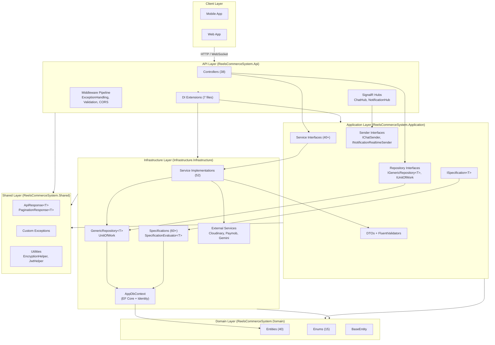
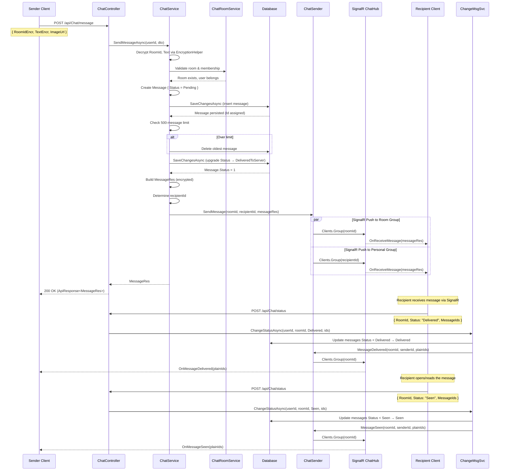
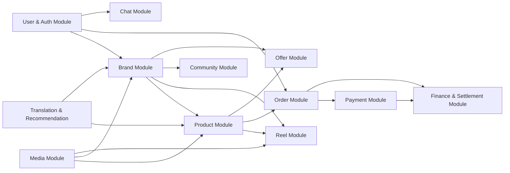
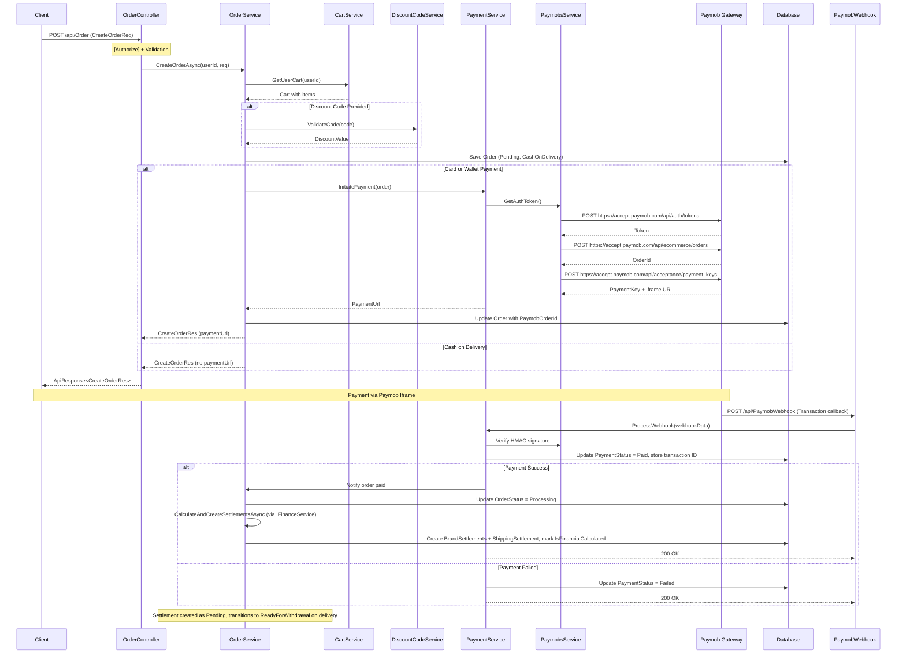
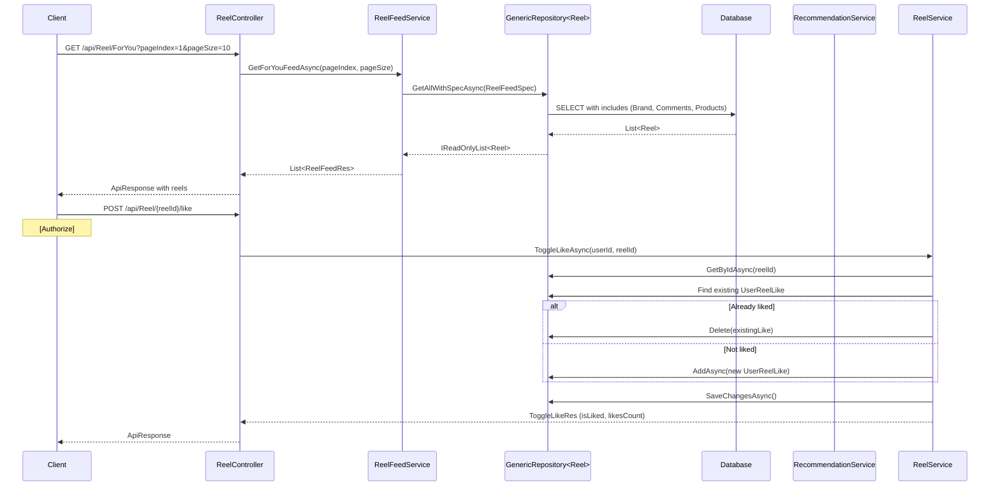
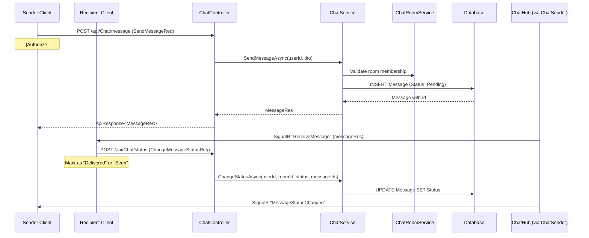
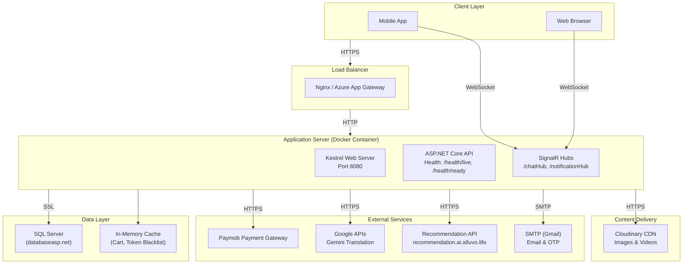

# System Architecture

This chapter presents a comprehensive architectural analysis of the ReelsCommerceSystem backend, a .NET 9.0 e-commerce platform. The analysis is organised into seven sections: the system's architectural style and solution organisation (Section 1), the ten core business modules it comprises (Section 2), the relational database design underpinning its data persistence layer (Section 3), the RESTful and real-time API design exposing its capabilities (Section 4), the security and authentication mechanisms protecting its resources (Section 5), the design patterns and SOLID principles guiding its implementation (Section 6), and the performance characteristics and deployment strategy that define its operational behaviour (Section 7). Each subsection references concrete code artefacts—classes, interfaces, methods, and configuration entries—to ground the architectural discussion in the actual implementation.

## 1. Architectural Style — Clean Architecture

The ReelsCommerceSystem backend is implemented using the **Clean Architecture** pattern (also referred to as Onion Architecture), which enforces a strict separation of concerns through concentric layers. The solution comprises five discrete .NET 9.0 projects organised as follows:

- **ReelsCommerceSystem.Domain** — Innermost layer containing enterprise-wide business entities, enumerations, and the `BaseEntity` abstract class (`ReelsCommerceSystem.Domain/Common/BaseEntity.cs:5`). This layer has zero external dependencies except for `MailKit`, `Microsoft.EntityFrameworkCore.Abstractions`, and `Microsoft.Extensions.Identity.Stores` (for the `IdentityUser` base class).
- **ReelsCommerceSystem.Shared** — Contains cross-cutting concerns: custom exception types (`NotFoundException`, `BadRequestException`, `UnauthorizedException`, `UserNotFoundException`), standardised API response wrappers (`ApiResponse<T>`, `PaginationResponse<T>`), and utility helpers (`EncryptionHelper`, `JwtHelper`, `FileHelper`, `Email`). Referenced by all other layers.
- **ReelsCommerceSystem.Application** — The use-case layer housing service interfaces (e.g., `IAuthenticationService`, `IOrderService`, `IReelService`), repository interfaces (`IGenericRepository<T>`, `ISpecification<T>`), DTOs, FluentValidation validators, and custom attributes (`AllowedImageExtensionsAttribute`, `RequiredWithArabicAttribute`). Depends only on `Domain` and `Shared`.
- **ReelsCommerceSystem.Infrastructure** (at `Infrastructure.Infrastructure/`) — Implements all interfaces declared in the Application layer: concrete `GenericRepository<T>`, `UnitOfWork`, the `Specification<T>` base class with its `SpecificationEvaluator<T>`, all service implementations (47 classes), the `AppDbContext` (Entity Framework Core), and Cloudinary media integration. Depends on `Application`, `Domain`, and `Shared`.
- **ReelsCommerceSystem.Api** — The presentation layer exposing RESTful endpoints via ASP.NET Core MVC controllers, SignalR hubs (`ChatHub`, `NotificationHub`), middleware (`ExceptionHandlingMiddleware`), dependency injection extension methods, and OpenAPI/Swagger configuration. This is the composition root where all dependencies are wired.

Layered architecture ensures that dependencies point **inward**: the Api layer references Infrastructure, Application, and Shared; Infrastructure references Application, Domain, and Shared; Application references only Domain and Shared. The Domain layer has no project references to any other layer.

## 2. Solution Structure and Project Organisation

The solution file `ReelsCommerceSystem.sln` organises projects into solution folders:

```
Solution Folders:
  Api/
    ReelsCommerceSystem.Api
  Application/
    ReelsCommerceSystem.Application
  Domain/
    ReelsCommerceSystem.Domain
  Infrastructure/
    ReelsCommerceSystem.Infrastructure
  Shared/
    ReelsCommerceSystem.Shared
```

Within each project, namespaces mirror folder structure:

- **Controllers** — `ReelsCommerceSystem.Api.Controllers`
- **Services** — `ReelsCommerceSystem.Infrastructure.Services`
- **Repositories** — `ReelsCommerceSystem.Infrastructure.Repositories`
- **Persistence** — `ReelsCommerceSystem.Infrastructure.Persistence`
- **Specifications** — `ReelsCommerceSystem.Infrastructure.Specifications.Common` and `...Specifications.Specifications.*`
- **DTOs** — `ReelsCommerceSystem.Application.DTOs.Request.{Module}` and `...DTOs.Response.{Module}`
- **Entities** — `ReelsCommerceSystem.Domain.Entities.{Module}Entities`

## 3. Technology Stack

### 3.1 Runtime and Framework
- **.NET 9.0** SDK and ASP.NET Core 9.0 runtime
- **C# 13** with nullable reference types and implicit usings enabled

### 3.2 Data Access
- **Entity Framework Core 9.0.9** with SQL Server provider
- **Microsoft.AspNetCore.Identity.EntityFrameworkCore 9.0.9** for ASP.NET Core Identity
- **EF Core Proxies** (lazy loading enabled via `Microsoft.EntityFrameworkCore.Proxies`)
- **EF Core InMemory** (8.0.21) used for development/testing scenarios

### 3.3 Authentication and Authorisation
- **Microsoft.AspNetCore.Authentication.JwtBearer 9.0.9** for JWT-based authentication
- **ASP.NET Core Identity** with custom `User` entity extending `IdentityUser`
- Token blacklisting mechanism (`ITokenBlacklistService` / `TokenBlacklistService`)

### 3.4 Real-Time Communication
- **ASP.NET Core SignalR** with two hubs: `ChatHub` and `NotificationHub`
- Hub paths mapped at `/chatHub` and `/notificationHub`

### 3.5 Media and Cloud Services
- **CloudinaryDotNet 1.27.8** for image and video upload management
- **MailKit 4.16.0** for SMTP email delivery (OTP, notifications)

### 3.6 API Documentation
- **Swashbuckle.AspNetCore 9.0.4** with OpenAPI 3.0 document generation
- Custom document transformers for JWT Bearer security scheme

### 3.7 Validation
- **FluentValidation 12.1.1** for request DTO validation
- Custom `ValidationActionFilter` implementing `IActionFilter` for ModelState validation
- JSON-based validation message resource file (`Resources/ValidationMessageResource.json`)

### 3.8 Observability
- **Serilog 4.3.0** with `Serilog.AspNetCore 9.0.0` for structured logging
- Sinks configured for Console output
- **Health Checks** with `AspNetCore.HealthChecks.UI.Client` and `Microsoft.Extensions.Diagnostics.HealthChecks.EntityFrameworkCore`
- Three health check endpoints: `/health/live`, `/health/ready`, `/health/details`

### 3.9 External Integrations
- **Paymob** payment gateway (Card, Wallet via integration IDs configured in `appsettings.json`)
- **Google OAuth 2.0** for social login
- **TikTok OAuth** for social login
- **Gemini API** (Google AI) for translation services
- **Recommendation Service** at `https://recommendation.ai.alluvo.life`

## 4. High-Level Component Architecture

```
┌─────────────────────────────────────────────────────────────┐
│                      API Layer (Presentation)               │
│  ┌─────────────┐ ┌──────────────┐ ┌──────────────────────┐  │
│  │ Controllers  │ │ SignalR Hubs │ │ Middleware Pipeline  │  │
│  │ (34 classes) │ │ ChatHub,     │ │ ExceptionHandling,  │  │
│  │              │ │ NotifHub     │ │ ValidationFilter    │  │
│  └──────┬───────┘ └──────┬───────┘ └──────────────────────┘  │
│         │                │                                    │
├─────────┼────────────────┼────────────────────────────────────┤
│         │     Application Layer (Use Cases)                   │
│  ┌──────┴───────┐  ┌───────────┐  ┌──────────────────────┐  │
│  │ Service Iface │  │ Repository│  │ DTOs + Validators    │  │
│  │ (40+ ifaces)  │  │ Ifaces    │  │ FluentValidation     │  │
│  └──────┬───────┘  └─────┬─────┘  └──────────────────────┘  │
├─────────┼────────────────┼────────────────────────────────────┤
│         │     Infrastructure Layer (Implementation)           │
│  ┌──────┴───────┐  ┌───────────┐  ┌──────────────────────┐  │
│  │ Services (47)│  │ Generic   │  │ AppDbContext (EF Core)│  │
│  │ + Cloudinary │  │ Repository│  │ + Migrations (18)    │  │
│  │ + Paymob     │  │ + UnitOfWork│ │ + Specifications(60)│  │
│  └──────┬───────┘  └─────┬─────┘  └──────────────────────┘  │
├─────────┼────────────────┼────────────────────────────────────┤
│         │     Domain Layer (Enterprise Business Rules)        │
│  ┌──────┴───────┐  ┌───────────┐  ┌──────────────────────┐  │
│  │ Entities (35)│  │ Enums(15) │  │ BaseEntity           │  │
│  └──────────────┘  └───────────┘  └──────────────────────┘  │
└──────────────────────────────────────────────────────────────┘
```

## 5. Dependency Injection Configuration

The composition root is `Program.cs` (`ReelsCommerceSystem.Api/Program.cs:13`), which orchestrates the entire dependency graph through a series of statically imported extension methods:

| Extension Method | Responsibility |
|---|---|
| `AddApplicationDBConfig` | Registers `AppDbContext` with SQL Server connection string based on environment (Development/Staging/Production); configures ASP.NET Core Identity with `User` and `IdentityRole` |
| `AddRepositoriesAndServices` | Registers `GenericRepository<T>`, `UnitOfWork`, and scans assemblies for all `*Service` classes to register their interfaces |
| `AddAppAuthenticationServices` | Configures JWT Bearer authentication with token validation parameters, SignalR token support via query string, and token blacklist validation |
| `AddApplicationCorsConfig` | Reads `AllowedOrigins` from configuration and registers CORS policy |
| `AddCloudinary` | Configures `CloudinarySettings` and registers `Cloudinary` singleton |
| `AddOpenApiConfig` | Registers OpenAPI document with JWT security scheme and schema transformers |
| `AddSerilog` | Configures Serilog from `appsettings.json` |
| `AddValidationMiddleware` | Disables default `ModelStateInvalidFilter` and adds `ValidationActionFilter` globally |

External HTTP clients are registered for `GeminiTranslationService`, `PaymobService`, and `RecommendationService` via `AddHttpClient<T>`. The `ChatSender` and `NotificationRealtimeSender` bridge the Application layer's sender interfaces to SignalR hub contexts.

## 6. Middleware Pipeline

The HTTP request pipeline in `Program.cs` (`ReelsCommerceSystem.Api/Program.cs:91-111`) is structured as follows:

```
Request → SerilogRequestLogging → ExceptionHandlingMiddleware →
         HttpsRedirection → StaticFiles → Authentication →
         Authorization → CORS → MapControllers → MapHubs →
         AppMiddleware (ForwardedHeaders, SwaggerUI, Auto Migrate,
         StatusCodePages, HealthChecks, WelcomeEndpoint)
```

Key middleware components:

- **`ExceptionHandlingMiddleware`** (`ReelsCommerceSystem.Api/Middlewares/ExceptionHandlingMiddleware.cs:11`) — Wraps the entire pipeline; catches unhandled exceptions and maps them to standardised `ApiResponse<object>` with bilingual messages. Specialised handlers exist for `NotFoundException`, `UserNotFoundException`, `UnauthorizedException`, and `BadRequestException`.
- **`ValidationActionFilter`** (`ReelsCommerceSystem.Api/Middlewares/ValidationActionFilter.cs:11`) — An `IActionFilter` applied globally that intercepts invalid `ModelState` and returns a bilingual `400 BadRequest` response with per-field validation errors.
- **`AppMiddleware`** (`ReelsCommerceSystem.Api/Middlewares/MiddlewaresExtensions/AppMiddlewareExtentions.cs:10`) — Applies forwarded headers for reverse proxy support, serves Swagger UI, auto-applies EF Core migrations on startup, configures status code pages (404 redirects to `/Api/Error/NotFound`), maps health check endpoints, and registers the welcome endpoint.

## 7. Solution Architecture Diagram



The architecture enforces strict layer separation: the API layer never accesses the DbContext directly; the Application layer never references infrastructure concerns; and the Domain layer remains completely isolated from framework details. This design supports testability, maintainability, and the ability to swap out infrastructure components (e.g., replacing EF Core with a different ORM) without affecting business logic.

# Core Business Modules

The ReelsCommerceSystem is decomposed into eleven business modules, each with clearly defined boundaries, entities, services, and controllers. The modular decomposition follows domain-driven design principles where aggregates and bounded contexts govern the separation.

## 1. User and Authentication Module

### 1.1 Module Boundary
This module manages user identity, registration, login, password management, OTP verification, and session lifecycle. It spans the `User` aggregate and supporting value objects.

### 1.2 Key Classes

**Entities:**
- `User` (`Domain/Entities/UserEntities/User.cs:13`) — Extends `IdentityUser` with `DisplayName`, `ImageURL`, `FirstName`, `LastName`, `Gender`, `DateOfBirth`, `IsBanned`, `Otp`, and navigation collections for orders, reviews, interests, follows, likes, views, comments, notifications, and brand ownership.
- `Address` (`Domain/Entities/UserEntities/Address.cs:7`) — Owned by `User` via `ShippingAddresses` collection; stores `Name`, `Street`, `City`, `Country`, `Postcode`, `PhoneNumber`, `IsDefault`.
- `Otp` (`Domain/Entities/UserEntities/Otp.cs:7`) — Owned value type with `Code`, `CreatedAt`, computed `IsValid` (10-minute window), and `CanResend` (1-minute cooldown).
- `Notification` (`Domain/Entities/UserEntities/Notification.cs:12`) — Stores bilingual messages (`Message`, `MessageAr`), `NotificationType` enum, `ReferenceId`, and `IsRead` flag.

**Services:**
- `IAuthenticationService` → `AuthenticationService` (`Infrastructure/Services/AuthenticationService.cs`) — Handles `LoginAsync`, `RegisterAsync`, `CheckEmailAsync`, `SignOutAsync`.
- `IJWTService` → `JWTService` — Generates JWT tokens for authenticated users.
- `IOtpService` → `OtpService` — Sends OTP via email and validates codes.
- `ITokenBlacklistService` → `TokenBlacklistService` — Manages a blacklist of revoked JWT tokens stored in memory (`ConcurrentDictionary`).
- `IUserInfoService` → `UserInfoService` — Retrieves authenticated user profile.
- `IUserProfileService` → `UserProfileService` — Updates user profile fields, avatar upload.

**Controller:** `AuthController` (`Api/Controllers/AuthController.cs:10`) — Exposes endpoints: `POST Login`, `POST Register`, `GET CheckEmail`, `POST SignOut`, `GET UserInfo`, `POST ForgetPassword`, `POST ResetPassword`, `GET UserInterests`.

### 1.3 Registration Flow Trace
```
POST /api/Auth/Register [FromForm]
  → ValidationActionFilter.OnActionExecuting (ModelState check)
  → AuthController.Register()
    → IAuthenticationService.RegisterAsync(RegisterReqDto)
      → Check email uniqueness via UserManager.FindByEmailAsync
      → Create User via UserManager.CreateAsync
      → Assign "Customer" role via UserManager.AddToRoleAsync
      → Generate JWT via IJWTService.GenerateToken()
      → Return RegisterResDto (token, user info)
  → ApiResponse<RegisterResDto>.SuccessResponse()
```

## 2. Brand Module

### 2.1 Module Boundary
Covers brand registration, verification, rejection, approval lifecycle, brand reviews, brand following, and brand public profile.

### 2.2 Key Classes

**Entities:**
- `Brand` (`Domain/Entities/BrandEntities/Brand.cs:7`) — Central aggregate with `DisplayName`, `Description`, `LogoUrl`, `ReturnPolicyAsHtml`, `Status` (BrandStatus enum), `CurrentStep` (BrandStep enum), `AverageRating`, `NumOfReviews`, `Category`, `Country`, `Governorate`, `District`, `NumberOfEmployees`.
- `BrandVerification` (`Domain/Entities/BrandEntities/BrandVerification.cs:10`) — One-to-one with `Brand`; stores `FullName`, `NationalId`, `TaxNumber`, identity document image URLs, `PhoneNumber`.
- `RejectionReason` (`Domain/Entities/BrandEntities/RejectionReason.cs:7`) — Reusable lookup with `Code` and `Description`.
- `BrandReview` (`Domain/Entities/BrandEntities/BrandReview.cs:7`) — User-submitted rating (`Rating`, `Comment`) with like/dislike tracking.
- `UserBrandFollow` (`Domain/Entities/BrandEntities/UserBrandFollow.cs:7`) — Many-to-many relationship between users and brands with `FollowedAt` timestamp.

**Services:**
- `IBrandService` → `BrandService` — `CreateBrandAsync`, `GetBrandInfoAsync`, `GetBrandPolicyAsync`, `ToggleFollowAsync`, `AddOrUpdateReview`, `BrandReviewLikeAsync`, `BrandReviewDislikeAsync`, `GetAverageRating`, `GetMyBrandAsync`, `GetBrandStatusAsync`.
- `IBrandVerificationService` → `BrandVerificationService` — `VerifyBrandAsync` (upload ID images to Cloudinary, create `BrandVerification` record).
- `IAdminBrandService` → `AdminBrandService` — `GetPendingAsync`, `GetDetailsAsync`, `ApproveAsync`, `RejectAsync`, `BanUserAsync`.
- `IRejectionReasonService` → `RejectionReasonService` — CRUD for rejection reasons.

**Controllers:**
- `BrandController` — Public brand profile, reviews, follows.
- `BrandVerificationController` — Identity verification document upload.
- `AdminBrandController` — Admin brand request management.
- `AdminController` — Admin authentication and dashboard.

### 2.3 Brand Approval Flow Trace
```
POST /api/BrandVerification/verify [Authorize]
  → BrandVerificationController.VerifyBrand()
    → IBrandVerificationService.VerifyBrandAsync()
      → Validate with FluentValidation (VerifyBrandRequestValidator)
      → Upload ID front/back + selfie to Cloudinary
      → Create BrandVerification entity
      → Update Brand.Status = PENDING_APPROVAL, Brand.CurrentStep = PENDING_REVIEW
      → Return success response

... Admin reviews pending brands ...

GET /api/admin/brand-requests
  → AdminBrandController.GetPending()
    → IAdminBrandService.GetPendingAsync()
      → Specification: GetPendingBrandsSpec (Status == PENDING_APPROVAL)
      → Return list with verification details

POST /api/admin/brand-requests/{id}/approve
  → AdminBrandController.Approve(id)
    → IAdminBrandService.ApproveAsync()
      → Load Brand with BrandVerification via GetBrandDetailsSpec
      → Set Brand.Status = APPROVED, Brand.CurrentStep = COMPLETED
      → Assign "BrandOwner" role to Brand.User
      → Create notification for brand owner
      → SaveChangesAsync
```

## 3. Product Module

### 3.1 Module Boundary
Product catalogue management including creation, editing, image management, categorisation, colour/size variants, product information, and pricing.

### 3.2 Key Classes

**Entities:**
- `Product` (`Domain/Entities/Products/Product.cs:7`) — Core aggregate with `Name`, `Description` (English), `ArDescription` (Arabic), `Price`, `DiscountPercentage`, `Rating`, `IsCustomizable`, `BrandId`, `CategoryId`.
- `ProductCategory` — `Name`, `ArName`, `ImageUrl`.
- `ProductImage` — `Url`, `PublicId` (Cloudinary reference).
- `ProductColor` — Reference entity with `Name`, `ArName`, `HexCode`.
- `ProductSize` — Reference entity mapped to `Size` enum.
- `ProductColorMapping` — Join entity linking `Product` → `ProductColor` with available quantities.
- `ProductSizeMapping` — Join entity linking `ProductColorMapping` → `ProductSize` with per-size quantity.
- `ProductInformation` — Dynamic key-value attributes with bilingual support (`Key`/`ArKey`, `Value`/`ArValue`), `InformationType`, and `Group` categorisation.
- `ProductReview` — User-submitted rating and comment for a product.

**Services:**
- `IProductService` → `ProductService` — `GetProductByIdAsync`, `GetProductsAsync` (with SpecParams filtering), `GetRelatedProductsAsync`.
- `IBrandProductService` → `BrandProductService` — `AddProductAsync`, `EditProductAsync`, `DeleteProductAsync`, `GetBrandProductsAsync`, `UploadImagesAsync`, `DeleteImageAsync`.

**Controllers:**
- `ProductController` — Public product listing and detail endpoints.
- `BrandProductController` — Brand owner product management (CRUD).

### 3.3 Product Retrieval Flow Trace
```
GET /api/Product?Search=...&BrandId=...&MinPrice=...&SortBy=price&SortOrder=desc&PageIndex=1&PageSize=10
  → ProductController.GetProducts([FromQuery] ProductSpecParams)
    → IProductService.GetProductsAsync(specParams)
      → Create ProductSpec(specParams) with:
          - Criteria: search, brand, price range, category, stock status, offer filter
          - Sorting: by name, price, date, discount, popularity, rating
          - Paging: PageIndex / PageSize
          - Includes: Brand, Category, Colors, Sizes, Reviews, Images
      → IGenericRepository<Product>.GetAllWithSpecAsync(spec)
      → spec.GetCountAsync(_context.Products)
      → Map to List<ProductResDto>
      → Return PaginationResponse<ProductResDto>
```

### 3.4 Product Creation Flow Trace (with Auto-Translation)

```
POST /api/BrandProduct/products [Authorize]
  → BrandProductController.AddProduct([FromBody] AddBrandProductReq)
    → IBrandProductService.AddProductAsync(req, userId)
      → Get brand by userId via IUnitOfWork
      → Create Product entity (without Description assignment yet)
      → AutoTranslateDescriptionAsync(request.Description, product):
          → ITranslationService.DetectLanguageAsync(description)
            → Gemini prompt: "Detect the language... reply exactly 'en' or 'ar'"
            → Returns "en" or "ar"
          → If detected "en":
              → product.Description = original text
              → ITranslationService.TranslateAsync(text, "en", "ar")
              → product.ArDescription = translated text (if translation succeeds)
          → If detected "ar":
              → product.ArDescription = original text
              → ITranslationService.TranslateAsync(text, "ar", "en")
              → product.Description = translated text (if translation succeeds)
          → If detection/translation fails: log warning, save with only original
      → Assign remaining fields (Name, Price, CategoryId, Colors, Sizes, Informations)
      → productRepo.AddAsync(product)
      → _unitOfWork.SaveChangesAsync()
      → Return ApiResponse<int>.SuccessResponse(product.Id)
```

See also Section 10 for the full `ITranslationService` interface documentation.

## 4. Reel Module

### 4.1 Module Boundary
Short-form video content management (Reels), including creation, feed generation, analytics, comments, likes, and product tagging.

### 4.2 Key Classes

**Entities:**
- `Reel` (`Domain/Entities/ReelEntities/Reel.cs:7`) — `VideoUrl`, `Title`, `ThumbnailUrl`, `Status` (Draft/Published), computed `NumOfLikes` and `NumOfWatches`.
- `ProductReels` — Many-to-many join between `Reel` and `Product`.
- `UserReelLike` — User like on a reel.
- `UserReelView` — User view with `WatchedDurationSeconds` and computed `WatchRatio`.
- `ReelComment` — User comment on a reel.
- `ReelCommentLove` — Like on a reel comment.
- `ReelCommentReply` — Nested replies on reel comments.
- `ReelCommentReplyLove` — Like on a reply.

**Services:**
- `IReelService` → `ReelService` — `CreateReelAsync`, `DeleteReelAsync`, `ToggleLikeAsync`, `RecordViewAsync`.
- `IReelFeedService` → `ReelFeedService` — `GetForYouFeedAsync` (FYP), `GetFollowingFeedAsync` (brand follow-based), `GetReelsByIdsAsync`.
- `IReelManagementService` → `ReelManagementService` — Brand owner's reel CRUD, product association, status management.
- `IReelCommentService` → `ReelCommentService` — Add, delete, and retrieve comments with pagination.
- `IReelAnalyticsService` → `ReelAnalyticsService` — View count and analytics retrieval.
- `IReplyService` → `ReplyService` — Add replies, toggle reply likes, paginated retrieval.

**Controllers:**
- `ReelController` — Public reel feed, likes, views.
- `ReelManagementController` — Brand's reel management.
- `ReelCommentController` — Reel comments.
- `CommentReplyController` — Nested replies.

### 4.3 Reel Feed Generation Flow Trace
```
GET /api/Reel/ForYou (or /Following)
  → ReelController.GetForYouFeed([FromQuery] int pageIndex, int pageSize)
    → IReelFeedService.GetForYouFeedAsync(pageIndex, pageSize)
      → If following feed:
          → GetUserFollowedBrandIds(userId)
          → Create ReelFeedSpec(followedBrandIds, pageIndex, pageSize) with:
              - Criteria: r => followedBrandIds.Contains(r.BrandId)
              - Includes: Brand, ReelComments, ProductReels → Product → Reviews & Images
              - OrderBy: CreatedAt descending
              - Paging applied
      → If for-you feed:
          → Create ReelFeedSpec(pageIndex, pageSize) with:
              - No criteria (all published reels)
              - Same includes and ordering
      → IGenericRepository<Reel>.GetAllWithSpecAsync(spec)
      → Map to List<ReelFeedRes>
      → Return ApiResponse<List<ReelFeedRes>>
```

## 5. Order and Checkout Module

### 5.1 Module Boundary
Shopping cart, order creation, discount code application, payment processing, order tracking, and lifecycle management.

### 5.2 Key Classes

**Entities:**
- `Cart` (`Domain/Entities/Order&ProductEntities/Cart.cs:7`) — User-owned cart with `ProductCarts` collection and `CreatedAt`.
- `Order` (`Domain/Entities/Order&ProductEntities/Order.cs:9`) — Central aggregate with `OrderStatus`, `PaymentStatus`, `PaymentMethod`, `TotalAmount`, `DiscountAmount`, shipping address fields, `PaymobOrderId`, `PaymobTransactionId`, `PaidAt`.
- `OrderProduct` — Line items with `ProductName`, `FinalPrice`, `Quantity`, `Color`, `Size`, `IsCustomized`, `ProductMediaUrls`.
- `OrderTracking` — Optional tracking with `TrackingNumber` and `Status`.
- `DiscountCode` — `Code` (unique), `UsageCount`, `ExpirationDate`, `DiscountValue`.
- `WishlistItem` — User's saved products.

**Services:**
- `ICartService` → `CartService` — `GetUserCart`, `AddToCartAsync`, `UpdateCartAsync`.
- `ICartCacheService` → `CartCacheService` — In-memory cart operations using `IMemoryCache`.
- `IOrderService` → `OrderService` — `CreateOrderAsync`, `GetOrdersForUserAsync`, `GetOrderDetailsAsync`, `CancelOrderAsync`.
- `IPaymentService` → `PaymentService` — Initiates Paymob payment, processes webhook callbacks.
- `IPaymobService` → `PaymobService` — Low-level Paymob API integration (auth token, order registration, payment key).
- `IDiscountCodeService` → `DiscountCodeService` — Validate and apply discount codes.
- `IWishlistService` → `WishlistService` — Add/remove/check wishlist items.

**Controllers:**
- `CartController` — Cart CRUD.
- `OrderController` — Order creation and management.
- `PaymentController` — Payment initiation.
- `PaymobWebhookController` — Paymob transaction callback.
- `WishlistController` — Wishlist management.
- `DiscountCodesController` — Discount code validation.

### 5.3 Order Creation Flow Trace
```
POST /api/Order [Authorize]
  → OrderController.CreateOrder([FromBody] CreateOrderReq)
    → Validated by CreateOrderReqValidator
    → IOrderService.CreateOrderAsync(userId, req)
      → Get cart from ICartService.GetUserCart(userId)
      → If discount code provided:
          → IDiscountCodeService.ValidateCode(code)
          → Apply discount: calculate DiscountAmount
      → Create Order entity with shipping address
      → Create OrderProduct entities from cart items
      → Clear cart via ICartCacheService.ClearCart(userId)
      → If PaymentMethod == Card or Wallet:
          → IPaymentService.InitiatePayment(order)
            → IPaymobService.GetAuthToken()
            → IPaymobService.CreateOrder(order, products)
            → IPaymobService.GetPaymentKey(orderId, amount)
            → Return payment URL (iframe)
      → If PaymentMethod == CashOnDelivery:
          → Set PaymentStatus = PayOnDelivery
          → Save order
      → Return CreateOrderRes with order details and payment URL
```

## 6. Chat and Real-Time Messaging Module

### 6.1 Module Boundary
One-to-one real-time messaging between users and brand owners, with room management, message status tracking (Pending → DeliveredToServer → Delivered → Seen), SignalR push notifications, and client-side encryption of all message content across the network.

### 6.2 Domain Entities

**`ChatRoom`** (`Domain/Entities/ChatEntities/ChatRoom.cs:7`)

| Field | Type | Notes |
|---|---|---|
| `Id` | `int` (PK, from `BaseEntity`) | Auto-increment |
| `User1Id` | `string` | FK to `Users` (Restrict delete) |
| `User2Id` | `string` | FK to `Users` (Restrict delete) |
| `User1` | `virtual User` | Navigation property |
| `User2` | `virtual User` | Navigation property |
| `Messages` | `virtual ICollection<Message>` | 1-to-many navigation collection |
| `CreatedAt` | `DateTime` | From `BaseEntity` |
| `UpdatedAt` | `DateTime` | From `BaseEntity` |

Duplicate rooms are prevented at the application layer: `ExistingChatRoomSpec` checks both orderings `(User1, User2)` and `(User2, User1)` before creating a new room.

**`Message`** (`Domain/Entities/ChatEntities/Message.cs:9`)

| Field | Type | Notes |
|---|---|---|
| `Id` | `int` (PK, from `BaseEntity`) | Auto-increment |
| `RoomId` | `int` | FK to `ChatRooms` (Cascade delete) |
| `SenderId` | `string` | FK to `Users` (Restrict delete) |
| `Text` | `string?` | Nullable — message can be just an image |
| `ImageUrl` | `string?` | Nullable — message can be just text |
| `Status` | `MessageStatus` (enum) | Defaults to `Pending` |
| `CreatedAt` | `DateTime` | From `BaseEntity` |
| `UpdatedAt` | `DateTime` | From `BaseEntity` |

**`MessageStatus` Enum** (`Domain/Enums/MessageStatus.cs`):
- `Pending` = 0 — Message created but not yet confirmed delivered to server
- `DeliveredToServer` = 1 — Server has persisted the message
- `Delivered` = 2 — Recipient's device has received it (via SignalR)
- `Seen` = 3 — Recipient has opened/read the message

### 6.3 Service Layer

**`IChatRoomService`** → `ChatRoomService` (`Infrastructure/Services/ChatRoomService.cs`)

| Method | Description |
|---|---|
| `GetUserRooms(string userId)` | Returns all rooms for a user, ordered by last message time descending. Includes other user's name/image, unread count, and last message preview. |
| `GetUnreadCount(int roomId, string userId)` | Counts messages where `SenderId != userId && Status != Seen`. |
| `CreateRoom(string user1, string user2)` | Checks `ExistingChatRoomSpec` for duplicates; creates new `ChatRoom` if not found; returns existing room ID otherwise (idempotent). |
| `GetRoomRes(int roomId, string userId)` | Returns a `ChatRoomRes` DTO for a specific room. |
| `DeleteRoom(int roomId)` | Deletes all messages then the room itself. |

**`IChatService`** → `ChatService` (`Infrastructure/Services/ChatService.cs`)

| Method | Description |
|---|---|
| `SendMessageAsync(string userId, SendMessageReq dto)` | Decrypts payload, validates room membership, creates `Message` (Pending), saves, enforces 500-message cap (deletes oldest), upgrades status to `DeliveredToServer`, pushes via SignalR via `IChatSender`. |
| `GetMessagesAsync(string userId, string roomIdEncr, int? page, int? pageSize, bool? unreadOnly, string? afterMessageId)` | Paginated retrieval with optional cursor-based pagination (`afterMessageId`) and `unreadOnly` filter. Returns encrypted DTOs. |
| `DeleteMessageAsync(string userId, string messageIdEnc)` | Decrypts message ID, verifies sender ownership, hard-deletes the message row, notifies recipient via SignalR. |
| `DeleteAllMessagesAsync(string userId, string roomIdEnc)` | Decrypts room ID, hard-deletes all messages in the room, notifies recipient with `"ALL"` signal. |

**`IChangeMessageStatusService`** → `ChangeMessageStatusService` (`Infrastructure/Services/ChangeMessageStatusService.cs`)

| Method | Description |
|---|---|
| `ChangeStatusAsync(string userId, string roomIdEnc, MessageStatus status, List<string> messageIdsEncrypted)` | Decrypts IDs; if specific IDs provided fetches those, otherwise fetches all unread messages with `Status < target`. Only upgrades status (never downgrades), skips messages owned by the caller. Notifies sender via SignalR (`MessageSeen` / `MessageDelivered`) |

**`IChatSender`** → `ChatSender` (`Api/SignalR/Senders/ChatSender.cs`)

Adapter class bridging `IHubContext<ChatHub>` to the Application layer interface. Each method sends to both the **room group** (for active chat participants) and the **recipient's personal group** (for sidebar/unread updates):

| Method | SignalR Event | Groups |
|---|---|---|
| `SendMessage(roomId, recipientId, message)` | `OnReceiveMessage` | Room group + recipient personal group |
| `MessageSeen(roomId, recipientId, plainMessageIds)` | `OnMessageSeen` | Room group + recipient personal group |
| `MessageDelivered(roomId, recipientId, plainMessageIds)` | `OnMessageDelivered` | Room group + recipient personal group |
| `MessageDeleted(roomId, recipientId, plainMessageId)` | `OnMessageDeleted` | Room group + recipient personal group |
| `RoomCreated(userId, room)` | `OnRoomCreated` | Personal group only |
| `RoomDeleted(roomId, recipientId)` | `OnRoomDeleted` | Room group + recipient personal group |

### 6.4 SignalR Hub — ChatHub

**Mapped at:** `/chatHub` (registered in `Program.cs`)

**Connection Setup (`OnConnectedAsync` override):**
1. Extract `userId` from JWT claims (`ClaimTypes.NameIdentifier`, `"sub"`, or `"uid"`).
2. Add the connection to a **personal group** named by `userId` — this receives sidebar updates (room creation, message previews, status notifications) even when the user is not inside a chat room.
3. The client can additionally call `JoinRoom(encryptedRoomId)` to join a **room group** (named by plain `roomId`) for real-time message streaming within that conversation.

**Hub Methods Callable from Clients:**

| Method | Parameters | Behaviour |
|---|---|---|
| `JoinPersonalGroup()` | — | Explicitly join the user's personal group (for reconnection scenarios). |
| `JoinRoom(string encryptedRoomId)` | Encrypted room ID | Decrypts room ID, adds connection to the room group. |
| `SendMessage(string encryptedRoomId, string encryptedMessage)` | Encrypted room ID + message | Alternative client-to-client path (primary path is REST API). |
| `SeenMessage(string encryptedMessageId)` | Encrypted message ID | Broadcasts `OnMessageSeen` to all clients. |
| `MessageDelivered(string encryptedMessageId)` | Encrypted message ID | Broadcasts `OnMessageDelivered` to all clients. |

**Client-Side Events (Server → Client):**

| Event | Payload | Trigger |
|---|---|---|
| `OnReceiveMessage` | `MessageRes` object | New message sent |
| `OnMessageSeen` | `List<string>` (plain message IDs) | Recipient read messages |
| `OnMessageDelivered` | `List<string>` (plain message IDs) | Recipient received messages |
| `OnMessageDeleted` | `string` (plain message ID) | A message was deleted |
| `OnRoomCreated` | `ChatRoomRes` object | A new room was created |
| `OnRoomDeleted` | `string` (plain room ID) | A room was deleted |

### 6.5 Controller — ChatController

**Base Route:** `api/Chat` (from `AppBaseController`)

| HTTP | Route | Auth | Method | Description |
|---|---|---|---|---|
| GET | `/api/Chat/rooms` | `[Authorize]` | `GetAllRooms()` | Returns `IEnumerable<ChatRoomRes>` for the current user |
| GET | `/api/Chat/rooms/{roomIdEncr}/messages` | `[Authorize]` | `GetMessages(roomIdEncr, page?, pageSize?, unreadOnly?, afterMessageId?)` | Paginated messages with optional cursor and unread filter |
| GET | `/api/Chat/rooms/unreadCount/{roomIdEncr}` | `[Authorize]` | `GetUnreadCount(roomIdEncr)` | Unread count for a specific room |
| POST | `/api/Chat/message` | `[Authorize]` | `SendMessage(SendMessageReq dto)` | Send a text/image message |
| POST | `/api/Chat/room` | `[Authorize]` | `CreateRoom(int brandId)` | Create a room with a brand (looks up brand owner's userId) |
| POST | `/api/Chat/status` | `[Authorize]` | `ChangeMessageStatus(ChangeMessageStatusReq)` | Mark messages as Delivered or Seen |
| DELETE | `/api/Chat/message/{messageIdEnc}` | `[Authorize]` | `DeleteMessage(messageIdEnc)` | Delete a single owned message |
| DELETE | `/api/Chat/room/{roomIdEnc}/messages` | `[Authorize]` | `DeleteAllMessages(roomIdEnc)` | Delete all messages in a room |
| DELETE | `/api/Chat/room/{roomIdEncr}` | `[Authorize]` | `Delete(roomIdEncr)` | Delete an entire room (with messages) |

### 6.6 Room Creation Flow

```
User A clicks "Chat with Brand":
  POST /api/Chat/room?brandId=X [Authorize]
    → ChatController.CreateRoom(brandId)
      → BrandRepository.GetByIdAsync(brandId)
      → ChatRoomService.CreateRoom(userId, brand.UserId)
        → ExistingChatRoomSpec(userId, brandUserId)
          → If room exists → return existing room ID
          → If not → Create ChatRoom { User1Id = userId, User2Id = brandUserId }
        → Build ChatRoomRes for both users
      → _chatSender.RoomCreated(brandUserId, roomForBrand)   // Notify brand owner
      → _chatSender.RoomCreated(userId, roomForUser)          // Multi-tab sync
    → Return encrypted room ID
```

Both users receive `OnRoomCreated` via their personal SignalR groups, prompting the UI to add the new room to the sidebar.

### 6.7 Message Status Lifecycle

```
Status: Pending (0)
  │  Message created in memory on the server
  │
  ▼  First SaveChangesAsync
Status: Pending (0) — persisted to database
  │
  ▼  Immediately after save, second SaveChangesAsync
Status: DeliveredToServer (1) — server confirms receipt
  │
  ▼  Recipient's SignalR client receives OnReceiveMessage
  │  Recipient client calls POST /api/Chat/status { Status: "Delivered" }
  │  → ChangeMessageStatusService upgrades Status < Delivered → Delivered
  │  → ChatSender.MessageDelivered() → OnMessageDelivered event
Status: Delivered (2) — confirmed on recipient's device
  │
  ▼  Recipient opens/views the message
  │  Client calls POST /api/Chat/status { Status: "Seen" }
  │  → ChangeMessageStatusService upgrades Status < Seen → Seen
  │  → ChatSender.MessageSeen() → OnMessageSeen event
Status: Seen (3) — recipient has read the message
```

Rules:
- Status can only **upgrade** (never downgrade).
- A user **cannot** mark their own messages.
- If no specific message IDs are provided, all unread messages with `Status < target` are updated (bulk status change).

### 6.8 Complete Message Send Flow (Sequence Diagram)



### 6.9 Encryption Pattern

All chat payloads crossing the network boundary are encrypted using `EncryptionHelper`:
- **SendMessageReq**: `RoomIdEncr`, `TextEncr` (image URLs are plain).
- **MessageRes**: `MessageIdEncr`, `RoomIdEncr`, `SenderIdEncr`, `TextEncr`, `ImageUrlEncr`.
- **URL parameters**: Room IDs and message IDs in route parameters are encrypted.
- Decryption in service methods applies `Uri.UnescapeDataString()` before `EncryptionHelper.Decrypt()`.
- Hub methods replace `" "` with `"+"` in encrypted strings before decryption.

### 6.10 SignalR Connection Model

```
Client connects to /chatHub (WebSocket upgrade)
  ↓
OnConnectedAsync:
  ↓
Extract userId from JWT (ClaimTypes.NameIdentifier / "sub" / "uid")
  ↓
Groups.AddToGroupAsync(connectionId, userId)     ← Personal group
  ↓
Client calls hub.JoinRoom(encryptedRoomId)
  ↓
Decrypt roomId
  ↓
Groups.AddToGroupAsync(connectionId, roomId)     ← Room group
```

- **Personal group** (`userId`): Receives sidebar updates, room creation/deletion, and message notifications when the user is not inside the chat room.
- **Room group** (`roomId`): Receives real-time messages and status updates when the user is actively viewing the conversation.

## 7. Community Module

### 7.1 Module Boundary
Brand community management including blog-style posts, comments, likes, and engagement features.

### 7.2 Key Classes

**Entities:**
- `CommunityPost` — `Title`, `Slug`, `Content`, `CoverImageUrl`, `Status` (Draft/Published), `CommentsEnabled`, `BrandId`.
- `PostComment` — Comment on community posts with nested replies (`ParentCommentId`).
- `PostLike` — Brand like on a post.
- `PostCommentLike` — Brand like on a comment.

**Services:**
- `ICommunityService` → `CommunityService` — `CreatePostAsync`, `GetPostAsync`, `GetPostsAsync`, `EditPostAsync`, `DeletePostAsync`, `TogglePostLikeAsync`, `AddCommentAsync`, `DeleteCommentAsync`, `ToggleCommentLikeAsync`.
- `IPostCommentService` → `PostCommentService` — Comment-specific operations.

**Controller:** `CommunityController` — Full REST API for community features.

## 8. Offer Module

### 8.1 Module Boundary
Time-limited promotional offers that bundle products with discount percentages.

### 8.2 Key Classes

**Entities:**
- `Offer` (`Domain/Entities/OfferEntities/Offer.cs:7`) — `Description`, `DiscountPercentage`, `ImageUrl`, `PublicId`, `BrandId`.
- `OfferProduct` — Composite key join (`OfferId`, `ProductId`) linking offers to products.

**Services:**
- `IOfferService` → `OfferService` — CRUD for offers, today's offers, recent offers.
- `ITodayOfferService` → (via `TodayOfferController`).

**Controllers:**
- `TodayOfferController` — Today's active offers.
- `OfferController` (via brand product routes).

## 9. Media and Storage Module

### 9.1 Module Boundary
File upload, image/video processing, and cloud storage management through Cloudinary.

### 9.2 Key Classes

**Services:**
- `ICloudinaryService` → `CloudinaryService` — Upload photos and videos with transformation, delete by public ID.
- `IPhotoServive` → `PhotoService` — Photo-specific upload with Cloudinary upload presets.
- `IFileStorageService` → `FileStorageService` — Local file storage for video uploads.
- `IUserImageService` → `UserImageService` — User avatar management.

**Controller:** `MediaController` — Video upload endpoints.

## 10. Translation and Recommendation Module

### 10.1 Module Boundary
External AI-powered services for content translation, product recommendation, and cross-entity search.

### 10.2 Key Classes

**Services:**

**`ITranslationService`** → `GeminiTranslationService` (`Infrastructure/Services/GeminiTranslationService.cs`)

Uses the Google Gemini API (`gemini-2.5-flash`) to translate content between English and Arabic. The interface exposes two methods:

| Method | Parameters | Description |
|---|---|---|
| `TranslateAsync` | `text`, `fromLanguage`, `toLanguage` | Translates text between specified language pairs. Sends a Gemini prompt requesting "Translate from {fromLanguage} to {toLanguage}. Return ONLY translated text." |
| `DetectLanguageAsync` | `text` | Detects whether the input text is English or Arabic. Sends a Gemini prompt requesting "Reply with exactly 'en' or 'ar'." Returns `DetectLanguageResponse` with `Success`, `Language`, and `ErrorMessage`. |

Both methods share a private `CallGeminiAsync(string prompt)` helper that constructs the HTTP request body, posts to `https://generativelanguage.googleapis.com/v1beta/models/gemini-2.5-flash:generateContent?key={apiKey}`, deserialises the `GeminiResponse`, and extracts the text from `candidates[0].content.parts[0].text`.

**Integration — Product Description Auto-Translation**

`BrandProductService` (`Infrastructure/Services/BrandProductService.cs`) injects `ITranslationService` and calls it during both `AddProductAsync` (creation) and `EditProductAsync` (update) via the private `AutoTranslateDescriptionAsync` method. The integration flow is:

1. **Language Detection**: The service calls `DetectLanguageAsync(description)` to determine if the text is English or Arabic.
2. **Field Assignment**: The original text is stored in the corresponding field — `Description` for English, `ArDescription` for Arabic.
3. **Translation**: The service calls `TranslateAsync` to generate the complementary language's text.
4. **Graceful Fallback**: If detection or translation fails, the product is saved with only the provided language and the failure is logged via `ILogger<BrandProductService>` — the operation is never blocked by a translation error.

See Section 3.4 for the full product creation flow trace.

**`IRecommendationService`** → `RecommendationService` — Calls external microservice at `https://recommendation.ai.alluvo.life` with a 10-second timeout to retrieve personalised product recommendations.

**`ISearchService`** → `SearchService` — Unified search across products, brands, and reels.

**Controllers:**
- `TranslationController` — `POST /api/Translation` — Accepts `TranslateRequest` (Text, FromLanguage, ToLanguage), returns translated text or error response.
- `SearchController` — `GET /api/Search` — Cross-entity search endpoint.

## 11. Finance and Settlement Module

### 11.1 Module Boundary
This module manages the financial settlement lifecycle between the platform, brands, and shipping companies. It handles commission calculation, automated settlement creation, wallet balance tracking, withdrawal requests, and payout disbursement through Paymob Payouts API (a separate API from Paymob Accept, using OAuth2 password grant authentication).

### 11.2 Key Classes

**Entities:**
- `BrandSettlement` (`Domain/Entities/FinanceEntities/BrandSettlement.cs`) — Tracks per-order earnings for each brand (`GrossAmount`, `PlatformCommission`, `NetAmount`); status lifecycle: `Pending` → `ReadyForWithdrawal` → `WithdrawalRequested` → `TransferInitiated` → `Processing` → `Paid`/`Failed`.
- `ShippingSettlement` (`Domain/Entities/FinanceEntities/ShippingSettlement.cs`) — Per-order shipping fee settlement for shipping companies; lifecycle: `Pending` → `ReadyToPay` → `Paid`.
- `WithdrawalRequest` (`Domain/Entities/FinanceEntities/WithdrawalRequest.cs`) — Brand-initiated withdrawal requests with `RequestedAmount`, linked to settlement status transitions.
- `FinancialAuditLog` (`Domain/Entities/FinanceEntities/FinancialAuditLog.cs`) — Immutable audit trail for all financial mutations (`Action`, `EntityType`, `OldValues`, `NewValues`, `PerformedBy`, `IpAddress`).
- `ShippingCompany` (`Domain/Entities/ShippingCompanyEntities/ShippingCompany.cs`) — Reference entity for shipping companies with contact info and `UserId` for role binding.

**Enums:**
- `SettlementStatus` — `Pending`, `ReadyForWithdrawal`, `WithdrawalRequested`, `TransferInitiated`, `Processing`, `Paid`, `Failed`
- `ShippingSettlementStatus` — `Pending`, `ReadyToPay`, `Paid`
- `WithdrawalRequestStatus` — `Pending`, `Approved`, `Rejected`, `Paid`

**Services:**
- `IFinanceService` → `FinanceService` (`Infrastructure/Services/Finance/FinanceService.cs`) — Orchestrates settlement creation on payment success (`CalculateAndCreateSettlementsAsync`), delivery-driven transitions (`MarkOrderAsDeliveredAsync`), wallet summaries, withdrawal lifecycle, admin payout processing, and policy retrieval. Uses `IUnitOfWork` for transactional consistency.
- `IPayoutProvider` → `PaymobPayoutProvider` (`Infrastructure/Services/Finance/PaymobPayoutProvider.cs`) — Abstracts the Paymob Payouts API: OAuth2 password grant (Basic auth `client_id:client_secret`, POST `/o/token/`), transfer creation (POST `/disburse/`), and status inquiry (POST `/transaction/inquire/`). Each transfer uses `client_reference_id` (uuid4) for idempotency.
- `PayoutStatusProcessor` (`Infrastructure/BackgroundServices/PayoutStatusProcessor.cs`) — Background hosted service that polls Paymob Payouts every 5 minutes for `TransferInitiated`/`Processing` settlements. Updates status to `Paid` or `Failed` based on Paymob response. Max 10 retries before marking as `Failed`.

**Repositories:**
- `IBrandSettlementRepository` → `BrandSettlementRepository`
- `IShippingSettlementRepository` → `ShippingSettlementRepository`
- `IWithdrawalRequestRepository` → `WithdrawalRequestRepository`
- `IFinancialAuditLogRepository` → `FinancialAuditLogRepository`

**Domain Services:**
- `FinancialCalculator` (`Domain/Services/Finance/FinancialCalculator.cs`) — Static domain service that applies a 1% platform commission on product subtotals (`ProductSubtotal`, `PlatformCommission`, `BrandAmount`, `ShippingCompanyAmount`).

**Controllers:**
- `AdminFinanceController` — Admin dashboard: brand/shipping summaries, pay brand & shipping settlements, policy management.
- `BrandFinanceController` — BrandOwner: wallet summary, settlement history, withdrawal creation.
- `ShippingFinanceController` — Shipping company: wallet summary, settlement history, policy.
- `PaymobPayoutWebhookController` — Optional callback endpoint for Paymob Payout status updates.

### 11.3 Financial Calculation Flow

```
Order Paid → CalculateAndCreateSettlementsAsync
  → Compute ProductSubtotal (sum of order product prices)
  → Compute PlatformCommission (1% of ProductSubtotal)
  → Compute BrandAmount (ProductSubtotal - PlatformCommission)
  → Compute ShippingCompanyAmount (based on DeliveryMethod)
  → Create BrandSettlement per brand involved in order
  → Create ShippingSettlement for the shipping company
  → Mark Order as IsFinancialCalculated = true
```

### 11.4 Settlement Lifecycle

```
Order Paid → BrandSettlement: Pending
  → Order Delivered → BrandSettlement: ReadyForWithdrawal
    → Brand submits WithdrawalRequest → BrandSettlement: WithdrawalRequested
      → Admin triggers payout → BrandSettlement: TransferInitiated
        → PayoutStatusProcessor polls Paymob → BrandSettlement: Processing (bank transfer)
          → Paymob confirms success → BrandSettlement: Paid
          → Paymob reports failure → BrandSettlement: Failed (retry up to 10x)
```

Shipping settlements follow a simpler flow: `Pending` → `ReadyToPay` (on delivery) → `Paid` (admin manually pays via dashboard).

### 11.5 Payout Configuration

Paymob Payouts credentials are configured in `PaymobPayoutSettings` section of `appsettings.json`, separate from Paymob Accept credentials. The payout API is hosted at a different base URL (`https://stagingpayouts.paymobsolutions.com/api/secure` in staging) and uses OAuth2 password grant with Basic authentication for the client credentials.

## 12. Module Dependency Graph



Each module communicates through the defined service interfaces in the Application layer. Cross-module dependencies (e.g., Order referencing Cart and Product, or Finance consuming Payment and Order events) occur through interface abstractions, ensuring that no concrete implementation details leak across module boundaries.

# Database Design

## 1. ORM and Configuration

The data access layer is built on **Entity Framework Core 9.0.9** with the **SQL Server** provider. The `AppDbContext` class (`Infrastructure.Infrastructure/Persistence/AppDbContext.cs:23`) extends `IdentityDbContext<User>`, integrating ASP.NET Core Identity tables directly into the application schema.

### 1.1 DbContext Configuration

The `AppDbContext` is configured in `AddApplicationDBConfig` (`Api/DependencyInjectionExtensions/AddApplicationDatabaseConfig.cs:13`), which selects the connection string based on the `ASPNETCORE_ENVIRONMENT` variable:

| Environment | Connection String Key |
|---|---|
| Development | `DevelopmentDB` |
| Staging | `StagingDB` |
| Production | `ProductionDB` |

Query tracking is disabled globally (`QueryTrackingBehavior.NoTracking`) for read-only queries, with explicit tracking enabled only when entities are attached for update or delete operations.

### 1.2 Entity Configuration Approach

Entity configurations are applied through `modelBuilder.ApplyConfigurationsFromAssembly(Assembly.GetExecutingAssembly())` (`AppDbContext.cs:45`), which scans for all `IEntityTypeConfiguration<T>` implementations. Additional relationships and constraints are configured directly in `OnModelCreating` for clarity.

## 2. Entity Relationship Diagram

### 2.1 Complete ERD (Mermaid)

```mermaid
erDiagram
    Users ||--o{ Addresses : "has"
    Users ||--o{ Orders : "places"
    Users ||--o{ ProductReviews : "writes"
    Users ||--o{ UserInterests : "has"
    Users ||--o{ UserBrandFollows : "follows"
    Users ||--o{ WishlistItems : "saves"
    Users ||--o{ UserReelLikes : "likes"
    Users ||--o{ UserReelViews : "views"
    Users ||--o{ ReelComments : "comments"
    Users ||--o{ ReelCommentLoves : "loves"
    Users ||--o{ ReelCommentReplyLoves : "loves"
    Users ||--o{ UserProductViews : "views"
    Users ||--o{ Notifications : "receives"
    Users ||--|| Brand : "owns"
    Users ||--o{ ChatRooms : "participates"
    Users ||--o{ Messages : "sends"

    Brand ||--o{ Products : "has"
    Brand ||--o{ BrandReviews : "receives"
    Brand ||--o{ UserBrandFollows : "followed_by"
    Brand ||--o{ Reels : "creates"
    Brand ||--o{ Offers : "promotes"
    Brand ||--o{ CommunityPosts : "publishes"
    Brand ||--o{ PostComments : "writes"
    Brand ||--o{ PostLikes : "likes"
    Brand ||--o{ PostCommentLikes : "likes"
    Brand }o--|| RejectionReason : "may_have"
    Brand ||--|| BrandVerification : "verified_by"

    ProductCategory ||--o{ Products : "categorises"
    Product ||--o{ ProductImages : "has"
    Product ||--o{ ProductReviews : "has"
    Product ||--o{ ProductColorMappings : "has_colors"
    Product ||--o{ ProductInformations : "has_info"
    Product ||--o{ ProductReels : "featured_in"
    Product ||--o{ OrderProducts : "ordered_in"
    Product ||--o{ WishlistItems : "wished_in"
    Product ||--o{ UserProductViews : "viewed_by"
    Product ||--o{ OfferProducts : "discounted_in"

    ProductColorMappings ||--o{ ProductSizeMappings : "has_sizes"
    ProductColorMappings }o--|| ProductColor : "color"
    ProductSizeMappings }o--|| ProductSize : "size"

    Offer ||--o{ OfferProducts : "includes"
    Reel ||--o{ ProductReels : "showcases"
    Reel ||--o{ UserReelLikes : "liked_by"
    Reel ||--o{ UserReelViews : "viewed_by"
    Reel ||--o{ ReelComments : "has_comments"
    
    ReelComments ||--o{ ReelCommentLoves : "has_loves"
    ReelComments ||--o{ ReelCommentReplies : "has_replies"
    ReelCommentReplies ||--o{ ReelCommentReplyLoves : "has_loves"

    CommunityPost ||--o{ PostComments : "has"
    CommunityPost ||--o{ PostLikes : "has"
    PostComments ||--o{ PostCommentLikes : "has"
    PostComments ||--o{ PostComments : "replies_to"

    Order ||--o{ OrderProducts : "contains"
    Order ||--o| OrderTrackings : "has_tracking"
    Order }o--|| DiscountCode : "may_use"

    ChatRoom ||--o{ Messages : "contains"

    Brand ||--o{ BrandSettlements : "has_settlements"
    Order ||--o{ BrandSettlements : "generates"
    Order ||--o| ShippingSettlements : "has_shipping_settlement"
    Brand ||--o{ WithdrawalRequests : "submits"
    ShippingCompany ||--o{ ShippingSettlements : "has_settlements"

    Interest ||--o{ UserInterests : "selected_by"

    UserInterests }o--|| Interests : "interest"
    UserInterests }o--|| Users : "user"
```



### 2.2 Identity Tables

The following ASP.NET Core Identity tables are integrated with custom table names configured in `AppDbContext.OnModelCreating`:

| Identity Table | Custom Name | Entity |
|---|---|---|
| `AspNetUsers` | `Users` | `User` |
| `AspNetRoles` | `Roles` | `IdentityRole` |
| `AspNetUserRoles` | `UserRoles` | `IdentityUserRole<string>` |
| `AspNetUserClaims` | `UserClaims` | `IdentityUserClaim<string>` |
| `AspNetUserLogins` | `UserLogins` | `IdentityUserLogin<string>` |
| `AspNetRoleClaims` | `RoleClaims` | `IdentityRoleClaim<string>` |
| `AspNetUserTokens` | `UserTokens` | `IdentityUserToken<string>` |

## 3. Key Relationships and Constraints

### 3.1 Delete Behavior Conventions

The database employs a mix of cascade and restrict delete behaviours to maintain referential integrity:

**Cascade Delete** (parent deletion propagates to children):
- `ReelComment` → `Reel` (when a reel is deleted, its comments are deleted)
- `ReelCommentLove` → `ReelComment`
- `ReelCommentReply` → `ReelComment` (parent comment deletion cascades to replies)
- `ReelCommentReplyLove` → `ReelCommentReply`
- `Message` → `ChatRoom`
- `Notification` → `User`
- `BrandVerification` → `Brand`

**Restrict Delete** (prevents parent deletion if children exist):
- `ReelComment` → `User`
- `ReelCommentLove` → `User`
- `ReelCommentReplyLove` → `User`
- `Message` → `Sender` (User)
- `ChatRoom` → `User1`, `User2`
- `Offer` → `Brand`

**SetNull Delete**:
- `Brand` → `RejectionReason` (when a rejection reason is deleted, brand's `RejectionReasonId` is set to null)

### 3.2 Unique Constraints

- `Brand.UserId` — One-to-one relationship between Brand and User (enforced by unique index)
- `BrandReview` on `(BrandId, UserId)` — Users can submit only one review per brand
- `ReelCommentLove` on `(ReelCommentId, UserId)` — Users can love a comment only once
- `ReelCommentReplyLove` on `(ReelCommentReplyId, UserId)` — Users can love a reply only once
- `DiscountCode.Code` — Discount codes must be unique

### 3.3 Decimal Precision

Monetary and percentage values use explicit precision to avoid rounding errors:

| Entity Property | Precision |
|---|---|
| `DiscountCode.DiscountValue` | (18, 2) |
| `OrderProduct.AppliedDiscountCodeAmount` | (18, 2) |
| `Offer.DiscountPercentage` | (18, 2) |

### 3.4 Finance Entity Relationships

- `Brand` → `BrandSettlement` — One-to-Many. A brand has many settlement records.
- `Order` → `BrandSettlement` — One-to-Many. An order generates settlements per brand.
- `Order` → `ShippingSettlement` — One-to-One. An order has one shipping settlement.
- `Brand` → `WithdrawalRequest` — One-to-Many. A brand submits many withdrawal requests.
- `ShippingCompany` → `ShippingSettlement` — One-to-Many. A shipping company has many settlements.

### 3.5 Composite Keys

- `OfferProduct` — Composite primary key: `(OfferId, ProductId)`

## 4. Indexing Strategy

### 4.1 Primary Keys
All entities inherit `BaseEntity` with `int Id` as the primary key (auto-increment). The `User` entity uses `string Id` (GUID) inherited from `IdentityUser`.

### 4.2 Foreign Key Indexes
EF Core automatically creates indexes for all foreign key columns, including:
- `Product.BrandId`, `Product.CategoryId`
- `Order.UserId`
- `Reel.BrandId`
- `Offer.BrandId`
- `CommunityPost.BrandId`
- `ChatRoom.User1Id`, `ChatRoom.User2Id`
- `Message.RoomId`, `Message.SenderId`

### 4.3 Unique Indexes
As specified in Section 3.2, unique indexes are explicitly created:
- `IX_Brand_UserId` (unique)
- `IX_BrandReview_BrandId_UserId` (unique)
- `IX_ReelCommentLove_ReelCommentId_UserId` (unique)
- `IX_ReelCommentReplyLove_ReelCommentReplyId_UserId` (unique)
- `IX_DiscountCode_Code` (unique)

## 5. Concurrency and Auditing

The `AppDbContext.SaveChangesAsync` override (`AppDbContext.cs:253`) automatically manages audit timestamps:
- On `EntityState.Added`: sets `CreatedAt` and `UpdatedAt` to `DateTime.UtcNow`
- On `EntityState.Modified`: sets `UpdatedAt` to `DateTime.UtcNow`

This is applied uniformly to all entities inheriting from `BaseEntity`, ensuring consistent audit trail across the entire database.

## 6. Migrations

As of the latest migration (`20260510212412_EnsureAllUsersHaveUserRole`), the database has 18 EF Core migrations applied:

| Migration | Description |
|---|---|
| `20260424163803_updatedChatEntities` | Chat entities initial schema |
| `20260425153149_CreateMessageAndChatRoom` | Message and ChatRoom creation |
| `20260425232023_ProductSeeding` | Seed product data |
| `20260430124919_AddImageUrlForCategory` | Add ImageUrl to ProductCategory |
| `20260506150404_EditReel(status,ThumbnailUrl)` | Reel status and thumbnail |
| `20260506173313_AddDiscountCodeModule` | DiscountCode entity |
| `20260506181834_FixOrderProductPrecision` | Decimal precision fix |
| `20260506191916_EditProduct(rating)` | Rating field on Product |
| `20260507200729_AdminLoginTable` | Admin login support |
| `20260508214025_SeedingViewsForReelId51` | Seed reel view data |
| `20260509111801_UpdatedProductImageEntity` | ProductImage updates |
| `20260509162244_UpdatatedOfferEntity` | Offer entity updates |
| `20260509163534_UpdatatedOfferEntityUrl` | Offer URL field |
| `20260509170353_AddedDiscountPercentageToOfferEntity` | Discount percentage on Offer |
| `20260509181808_CommunityEntities` | Community module tables |
| `20260509211157_EditCommunityEntities` | Community entity refinements |
| `20260510202430_SeedRolesAndUserRoles` | Role seeding |
| `20260510205819_AssignBrandOwnerRolesToExistingOwners` | BrandOwner role assignment |
| `20260510210928_AssignBrandOwnerRoleToBrandOwners` | Role assignment fix |
| `20260510212412_EnsureAllUsersHaveUserRole` | Default User role for all users |

### 6.1 Automatic Migration Application

On application startup, `AppMiddlewareExtentions.AddAppMiddleware` (`Api/Middlewares/MiddlewaresExtensions/AppMiddlewareExtentions.cs:36`) automatically applies pending migrations:
```csharp
using (var scope = app.Services.CreateScope())
{
    var dbContext = scope.ServiceProvider.GetRequiredService<AppDbContext>();
    dbContext.Database.Migrate();
}
```

## 7. Specification-Based Query System

### 7.1 Specification Pattern Overview

The `Specification<T>` class (`Infrastructure.Infrastructure/Specifications/Common/Specification.cs:10`) encapsulates query logic including:
- **Criteria** — `Expression<Func<T, bool>>` for WHERE clauses
- **Includes** — Eager loading via `Include` and `ThenInclude`
- **IncludeChains** — Complex multi-level include chains
- **OrderBy / OrderByDescending** — Sorting expressions
- **Paging** — `PageIndex` and `PageSize` for Skip/Take
- **QueryModifiers** — Additional query transformations (e.g., `AsSplitQuery()`)
- **Logical Operators** — `&` (AND), `|` (OR), `!` (NOT) for composing specifications

The `SpecificationEvaluator<T>` (`Infrastructure.Infrastructure/Specifications/Common/SpecificationEvaluator.cs:8`) applies the specification to an `IQueryable<T>` in order: Criteria → Includes → IncludeStrings → IncludeChains → OrderBy → Paging → QueryModifiers.

### 7.2 Pagination Specification Example

```csharp
public class ProductSpec : Specification<Product>
{
    public ProductSpec(ProductSpecParams specParams)
    {
        // Criteria: search, brand, price, category, stock, offer, color, size filters
        // Includes: Brand, Category, Colors, Sizes, Reviews, Images
        // Sorting: name, price, date, discount, popularity, rating
        // Paging: PageIndex, PageSize
        // QueryModifiers: AsSplitQuery()
    }
}
```

Usage in repository:
```csharp
var spec = new ProductSpec(specParams);
var products = await _productRepository.GetAllWithSpecAsync(spec);
var totalCount = await spec.GetCountAsync(_context.Products);
```

# API Design and Workflows

## 1. API Conventions

### 1.1 Base URL and Routing

All controllers inherit from `AppBaseController` (`Api/Controllers/AppBaseController.cs:5`), which applies:
```csharp
[Route("api/[controller]")]
[ApiController]
```
This convention ensures all endpoints follow the pattern `POST /api/{ControllerName}/{action}`. Attribute routing is used throughout for explicit path specification.

### 1.2 Standardised Response Format

Every API response follows the `ApiResponse<T>` envelope (`Shared/Responses/ApiResponse.cs`):

```json
{
  "success": true,
  "statusCode": 200,
  "message": {
    "en": "English message",
    "ar": "Arabic message"
  },
  "data": {},
  "errors": null
}
```

For paginated responses, `PaginationResponse<T>` extends this with a `Meta` block:
```json
{
  "success": true,
  "statusCode": 200,
  "data": [...],
  "meta": {
    "pageNumber": 1,
    "pageSize": 10,
    "totalRecords": 100,
    "hasPreviousPage": false,
    "hasNextPage": true
  }
}
```

### 1.3 Error Response Format

Validation errors use a per-field error format:
```json
{
  "success": false,
  "statusCode": 400,
  "message": { "en": "Validation failed", "ar": "..." },
  "errors": [
    { "field": "Email", "en": "Email is required", "ar": "..." }
  ]
}
```

## 2. Controller Inventory

The system exposes 38 controllers with the following summary:

| Controller | Base Route | Auth | Key Endpoints |
|---|---|---|---|
| `AuthController` | `api/Auth` | Mixed | Login, Register, CheckEmail, SignOut, UserInfo, ForgetPassword, ResetPassword, UserInterests |
| `AdminController` | `api/Admin` | None | Admin login |
| `BrandController` | `api/Brand` | Mixed | BrandInfo, BrandPolicy, Reviews, ToggleFollow, ToggleLike, CreateBrand, GetMyBrand, BrandStatus |
| `AdminBrandController` | `api/Admin/brand-requests` | None | GetPending, GetDetails, Approve, Reject, Ban |
| `BrandVerificationController` | `api/BrandVerification` | Authorize | VerifyBrand |
| `BrandProductController` | `api/BrandProduct` | Authorize | GetBrandProducts, AddProduct, UploadImages, PatchProduct, DeleteProduct |
| `ProductController` | `api/Product` | None | GetAll, GetById, GetRelatedProducts, GetRecommendations |
| `ReelController` | `api/Reel` | None | GetForYouFeed, GetFollowingFeed, GetReelById, ToggleLike, RecordView, Create, Delete |
| `ReelManagementController` | `api/ReelManagement` | Authorize | GetBrandReels, GetReel, Create, Update, Delete, AssignProducts |
| `ReelCommentController` | `api/ReelComment` | Authorize | GetComments, AddComment, DeleteComment |
| `CommentReplyController` | `api/CommentReply` | Authorize | GetReplies, AddReply, ToggleReplyLike |
| `CartController` | `api/Cart` | Authorize | GetCart, AddToCart, UpdateCart, ClearCart |
| `OrderController` | `api/Order` | Authorize | CreateOrder, GetOrders, GetOrderDetails, CancelOrder |
| `PaymentController` | `api/Payment` | Authorize | InitiatePayment, GetPaymentStatus |
| `PaymobWebhookController` | `api/PaymobWebhook` | None | TransactionCallback |
| `AdminFinanceController` | `api/admin/finance` | Admin | GetBrandSettlements, GetShippingSettlements, GetAllWithdrawals, PayBrandSettlement, PayShippingSettlement, GetWalletSummary, GetFinancePolicy |
| `BrandFinanceController` | `api/brand/finance` | BrandOwner | GetWalletSummary, GetSettlementHistory, CreateWithdrawalRequest, GetWithdrawalHistory, GetFinancePolicy |
| `ShippingFinanceController` | `api/shipping/finance` | BrandOwner | GetWalletSummary, GetSettlementHistory, GetFinancePolicy |
| `PaymobPayoutWebhookController` | `api/paymob-webhook` | None | PayoutCallback |
| `ChatController` | `api/Chat` | Authorize | GetRooms, GetMessages, SendMessage, CreateRoom, ChangeStatus, DeleteMessage, DeleteRoom |
| `CommunityController` | `api/Community` | Authorize | CreatePost, GetPost, GetPosts, EditPost, Delete, TogglePostLike, AddComment, DeleteComment, ToggleCommentLike |
| `NotificationController` | `api/Notification` | Authorize | GetNotifications, MarkAsRead, MarkAllAsRead, GetUnreadCount |
| `MediaController` | `api/Media` | Authorize | UploadVideo |
| `LookupController` | `api/Lookup` | None | GetCategories, GetBrands, GetInterests, GetRejectionReasons, GetColors, GetSizes |
| `SearchController` | `api/Search` | None | Search (products, brands, reels) |
| `TranslationController` | `api/Translation` | None | Translate (text) |
| `TodayOfferController` | `api/TodayOffer` | None | GetTodayOffers, GetRecentOffers |
| `DiscountCodesController` | `api/DiscountCodes` | Authorize | ValidateCode |
| `WishlistController` | `api/Wishlist` | Authorize | GetWishlist, AddToWishlist, RemoveFromWishlist, CheckInWishlist |
| `UserProfileController` | `api/UserProfile` | Authorize | GetProfile, UpdateProfile, UploadAvatar |
| `InterestController` | `api/Interest` | Authorize | GetInterests, SaveUserInterests |
| `OtpController` | `api/Otp` | None | SendOtp, VerifyOtp |
| `ContactUsController` | `api/ContactUs` | None | SubmitContactMessage |
| `ErrorController` | `api/Error` | None | NotFound, ExceptionHandlingTest |
| `GoogleAuthController` | `api/GoogleAuth` | None | Google OAuth callback |
| `TikTokAuthController` | `api/TikTokAuth` | None | TikTok OAuth callback |
| `TestRoomController` | `api/TestRoom` | None | Test endpoints |
| `TestNotificationController` | `api/TestNotification` | None | Test notification endpoints |

## 3. Complete Request/Response Flow

### 3.1 Authenticated Request Flow

```
Client → HTTPS Request
  → Kestrel (200MB request body limit configured)
    → SerilogRequestLogging (log request details)
      → ExceptionHandlingMiddleware.InvokeAsync()
        → HttpsRedirection (301 → HTTPS)
          → StaticFiles (check wwwroot)
            → AuthenticationMiddleware
              → JwtBearerHandler.AuthenticateAsync()
                → OnMessageReceived: Extract token from header or SignalR query
                → Validate token: issuer, audience, lifetime, signing key
                → OnTokenValidated: Check token blacklist
                → Set HttpContext.User with ClaimsPrincipal
              → AuthorizationMiddleware
                → [Authorize] attribute evaluated
                → User.Identity.IsAuthenticated check
              → CORS Middleware (AllowDevTunnel policy)
                → Endpoint Routing
                  → Controller Action Invocation
                    → ValidationActionFilter.OnActionExecuting (ModelState check)
                    → Action method executes
                      → Service → Repository → Database
                    → ValidationActionFilter.OnActionExecuted
                  → Action result formatted
                    → ApiResponse<T> serialized to JSON
                  → Response returned to client
```

### 3.2 Unauthenticated Error Flow

```
Client → Request to protected resource without JWT
  → JwtBearerHandler.AuthenticateAsync() → No token → NoResult
  → AuthorizationMiddleware → Challenge
  → JwtBearerHandler.OnChallenge:
    → Set 401 status code
    → Write ApiResponse<string>.ErrorResponse:
      {
        "success": false,
        "statusCode": 401,
        "message": {
          "en": "Unauthorized — please sign in to continue.",
          "ar": "غير مصرح — من فضلك سجّل الدخول عشان تكمل."
        }
      }
```

## 4. SignalR Real-Time Architecture

### 4.1 Hub Configuration

Two SignalR hubs are configured in `Program.cs`:
```csharp
app.MapHub<NotificationHub>("/notificationHub");
app.MapHub<ChatHub>("/chatHub");
```

JWT authentication is supported via query string for WebSocket connections:
```csharp
OnMessageReceived = context =>
{
    var accessToken = context.Request.Query["access_token"];
    if (!string.IsNullOrEmpty(accessToken) && 
        (path.StartsWithSegments("/chatHub") || path.StartsWithSegments("/notificationHub")))
    {
        context.Token = accessToken;
    }
}
```

### 4.2 Notification Hub

The `NotificationHub` handles real-time notification delivery. Senders push notifications through `INotificationRealtimeSender` → `NotificationRealtimeSender`:

```
Server event (e.g., order status change)
  → NotificationRealtimeSender.SendNotification(userId, notification)
    → NotificationHub.Clients.User(userId).SendAsync("ReceiveNotification", data)
```

### 4.3 Chat Hub

The `ChatHub` (`Api/SignalR/Hubs/ChatHub.cs`) manages real-time messaging, and `ChatSender` (`Api/SignalR/Senders/ChatSender.cs`) bridges the Application layer:

```
Message sent via REST
  → ChatService.SendMessageAsync()
    → ChatSender.SendMessage(recipientId, messageRes)
      → ChatHub.Clients.User(recipientId).SendAsync("ReceiveMessage", messageRes)

Room created via REST
  → ChatRoomService.CreateRoom()
    → ChatSender.RoomCreated(userId, roomRes)
      → ChatHub.Clients.User(userId).SendAsync("RoomCreated", roomRes)

Message status changed
  → ChangeMessageStatusService.ChangeStatusAsync()
    → ChatSender.MessageStatusChanged(userId, statusUpdate)
      → ChatHub.Clients.User(userId).SendAsync("MessageStatusChanged", statusUpdate)
```

## 5. Payment Workflow Sequence Diagram



## 6. Reel Feed and Interaction Sequence



## 7. Chat and Real-Time Messaging Sequence



## 8. Health Check Endpoints

| Endpoint | Purpose | Tags |
|---|---|---|
| `GET /health/live` | Liveness probe (always OK) | `live` |
| `GET /health/ready` | Readiness probe (checks DB connectivity) | `ready` |
| `GET /health/details` | Detailed health report via UIResponseWriter | All |

Health checks use `HealthChecks.UI.Client` for detailed JSON responses and `AddDbContextCheck` for database connectivity validation.

# Security and Authentication

## 1. Authentication Architecture

The system uses **JWT (JSON Web Token) Bearer authentication** implemented via `Microsoft.AspNetCore.Authentication.JwtBearer 9.0.9`. The authentication pipeline is configured in `AddAppAuthenticationServices` (`Api/DependencyInjectionExtensions/AddAppAuthentication.cs:10`).

### 1.1 Default Scheme Configuration

```csharp
services.AddAuthentication(options =>
{
    options.DefaultAuthenticateScheme = JwtBearerDefaults.AuthenticationScheme;
    options.DefaultChallengeScheme = JwtBearerDefaults.AuthenticationScheme;
})
```

### 1.2 Token Validation Parameters

| Parameter | Source | Description |
|---|---|---|
| `ValidateIssuer` | `JWTOptions:Issuer` (`https://localhost:1234/`) | Validates the `iss` claim matches the configured issuer |
| `ValidateAudience` | `JWTOptions:Audience` (`https://localhost:7146/api`) | Validates the `aud` claim matches the configured audience |
| `ValidateLifetime` | Enabled | Rejects expired tokens |
| `ValidateIssuerSigningKey` | `JWTOptions:SecretKey` (512-bit HMAC key) | Validates the token signature |

### 1.3 JWT Token Generation

Tokens are generated by `JWTService` (`Infrastructure/Services/JWTService.cs`) which creates a `JwtSecurityToken` with:
- Claims: `NameIdentifier` (user ID), `Email`, `DisplayName`, `Role`
- Expiration: Configurable via `JWTOptions`
- Signing: HMAC-SHA256 with the 512-bit secret key

## 2. Token Blacklisting

### 2.1 Blacklist Implementation

`TokenBlacklistService` (`Infrastructure/Services/TokenBlacklistService.cs`) maintains a `ConcurrentDictionary<string, DateTime>` in memory to track revoked tokens. On sign-out, the JWT is added to the blacklist with its expiration time as the value.

### 2.2 Validation Hook

During `OnTokenValidated` in the JWT Bearer events:

```csharp
OnTokenValidated = async context =>
{
    var blacklistService = context.HttpContext.RequestServices
        .GetRequiredService<ITokenBlacklistService>();
    var token = context.HttpContext.Items["RawJwtToken"] as string;

    if (!string.IsNullOrEmpty(token))
    {
        bool isBlacklisted = await blacklistService.IsBlacklistedAsync(token);
        if (isBlacklisted)
        {
            context.Fail("This token has been revoked. Please sign in again.");
            return;
        }
    }
}
```

## 3. Authorization Model

### 3.1 Role-Based Access

The system defines three roles via the `Role` enum (`Domain/Enums/Role.cs`):
- **Admin** — Full system access
- **BrandOwner** — Can manage brands, products, reels, offers
- **Customer** — Default role for registered users; can browse, purchase, and interact

Roles are assigned during registration (Customer) or brand approval (BrandOwner) via `UserManager.AddToRoleAsync`.

### 3.2 User Banishment

The `IsBanned` flag on the `User` entity (`Domain/Entities/UserEntities/User.cs:44`) is checked during authentication validation to prevent banned users from accessing the system.

### 3.3 Authorization Enforcement

Authorization is enforced at the controller level using the `[Authorize]` attribute. The system does not currently use granular `[Authorize(Roles = "...")]` attributes; instead, business-level authorisation is enforced within service implementations by checking user identity and ownership.

## 4. Security Events and Challenge Response

### 4.1 Custom Challenge Handler

On authentication failure (missing or invalid token), the `OnChallenge` event (`AddAppAuthentication.cs`) returns a standardised 401 response:

```json
{
  "success": false,
  "statusCode": 401,
  "message": {
    "en": "Unauthorized — please sign in to continue.",
    "ar": "غير مصرح — من فضلك سجّل الدخول عشان تكمل."
  }
}
```

### 4.2 SignalR Token Support

JWT tokens for WebSocket connections are extracted from the `access_token` query string parameter to support SignalR's transport limitations (headers are unavailable during WebSocket upgrade):

```csharp
OnMessageReceived = context =>
{
    var accessToken = context.Request.Query["access_token"];
    var path = context.HttpContext.Request.Path;
    if (!string.IsNullOrEmpty(accessToken) && 
        (path.StartsWithSegments("/chatHub") || path.StartsWithSegments("/notificationHub")))
    {
        context.Token = accessToken;
    }
}
```

## 5. Password and OTP Security

### 5.1 Password Policy

Configured in `AddApplicationDatabaseConfig` (`Api/DependencyInjectionExtensions/AddApplicationDatabaseConfig.cs:42`):
- Minimum length: 6 characters
- Requires digit, lowercase, and uppercase
- No non-alphanumeric requirement

### 5.2 OTP Implementation

The `Otp` owned value type (`Domain/Entities/UserEntities/Otp.cs:7`) enforces:
- **10-minute validity window**: `IsValid => CreatedAt.AddMinutes(10) > DateTime.UtcNow`
- **1-minute resend cooldown**: `CanResend => CreatedAt.AddMinutes(1) < DateTime.UtcNow`

OTP codes are sent via SMTP email through `OtpService` → `EmailService` using MailKit.

## 6. Social Authentication

### 6.1 Google OAuth 2.0

Configured in `appsettings.json`:
- `ClientId`: Google OAuth client identifier
- `ClientSecret`: Google OAuth client secret
- `RedirectUri`: `https://dev.api.alluvo.life/api/GoogleAuth/callback`

The `GoogleAuthController` handles the OAuth callback flow, exchanging the authorisation code for user credentials and creating/authenticating local user accounts.

### 6.2 TikTok OAuth

Configured similarly in `appsettings.json` with `ClientKey`, `ClientSecret`, and `RedirectUri`. The `TikTokAuthController` manages the TikTok OAuth flow.

## 7. Input Validation and Sanitisation

### 7.1 FluentValidation

Request DTOs are validated using FluentValidation 12.1.1. Key validators include:
- `VerifyBrandRequestValidator` — Egyptian National ID format (14 digits, century validation), Tax Number (9-15 digits), file size (≤5MB) and image type (JPEG, PNG, WEBP) validation
- `CreateOrderReqValidator` — Delivery method and payment method enum validation; conditional address validation

### 7.2 ModelState Validation

The `ValidationActionFilter` (`Api/Middlewares/ValidationActionFilter.cs:11`) globally intercepts invalid `ModelState` and produces bilingual error responses with per-field validation errors. Custom attributes include:
- `AllowedImageExtensionsAttribute` — Validates uploaded file extensions
- `RequiredWithArabicAttribute` — Ensures required fields with Arabic support

### 7.3 Custom Exception Types

The `Shared/Exceptions/` directory defines typed exceptions mapped to HTTP status codes:

| Exception | HTTP Status | Arabic Message |
|---|---|---|
| `NotFoundException` | 404 | "العنصر غير موجود" |
| `UserNotFoundException` | 404 | "المستخدم غير موجود" |
| `UnauthorizedException` | 401 | "غير مصرح بالدخول" |
| `BadRequestException` | 400 | "طلب غير صحيح" |

## 8. HTTPS and CORS

### 8.1 HTTPS Enforcement

`app.UseHttpsRedirection()` is applied in the middleware pipeline to redirect HTTP requests to HTTPS.

### 8.2 CORS Configuration

The `AddApplicationCorsConfig` extension (`Api/DependencyInjectionExtensions/AddApplicationCors.cs:10`) reads allowed origins from `appsettings.json` (`AllowedOrigins: ["*"]`). A named policy `AppCorsPolicy` is registered and applied after authentication. Forwarded headers are configured for reverse proxy deployments:

```csharp
app.UseForwardedHeaders(new ForwardedHeadersOptions
{
    ForwardedHeaders = ForwardedHeaders.XForwardedFor 
        | ForwardedHeaders.XForwardedProto 
        | ForwardedHeaders.XForwardedHost
});
```

## 9. API Key and Secret Management

Sensitive configuration values are stored in `appsettings.json`:
- JWT signing secret (512-bit hex string)
- Cloudinary API credentials
- SMTP email credentials
- Paymob API keys and HMAC secret
- Google and TikTok OAuth secrets
- Gemini API key

For production deployment, these values should be overridden via environment variables or Azure Key Vault / Docker secrets.

# Design Patterns and SOLID Principles

## 1. SOLID Compliance Analysis

### 1.1 Single Responsibility Principle (SRP)

Each class in the system has a clearly defined responsibility:

- **Controllers** — Handle HTTP request/response concerns only; delegate business logic to services.
- **Services** — Contain business logic and orchestration; operate exclusively through interface abstractions.
- **Repositories** — Manage data access and query execution for a single aggregate root.
- **Specifications** — Encapsulate query logic (criteria, includes, sorting, paging) for a single entity type.
- **Middlewares** — Handle cross-cutting concerns (exception handling, validation, logging) independently.

Example: `OrderService` (`Infrastructure/Services/OrderService.cs`) orchestrates cart retrieval, discount validation, order creation, and payment initiation but delegates actual data access to `GenericRepository<T>` and external calls to `IPaymobService`.

### 1.2 Open/Closed Principle (OCP)

The system is open for extension but closed for modification through:

- **Specification Pattern** — New query requirements are implemented by creating new `Specification<T>` subclasses without modifying existing repositories or services. Over 60 specification classes exist across 8 subfolders.
- **Generic Repository** — `GenericRepository<T>` provides standard CRUD operations for any `BaseEntity` without modification. Custom query behaviour is added through specifications rather than repository inheritance.
- **Service Registration** — The `RegisterRepositoriesExtention` scans assemblies for `*Service` classes and auto-registers them, allowing new services to be added without modifying DI registration code.

### 1.3 Liskov Substitution Principle (LSP)

- All service implementations conform to their interfaces (`IAuthenticationService`, `IOrderService`, etc.), ensuring they can be substituted without affecting consumers.
- Specification logical operators (`&`, `|`, `!`) return new `Specification<T>` instances (`AndSpecification<T>`, `OrSpecification<T>`, `NotSpecification<T>`) that extend the base class and satisfy the `ISpecification<T>` contract.
- The `GenericRepository<T>` implements `IGenericRepository<T>` with only `where T : BaseEntity`, allowing any entity to be used polymorphically.

### 1.4 Interface Segregation Principle (ISP)

The Application layer defines 40+ fine-grained service interfaces:

```
IAuthenticationService    → Login, Register, CheckEmail, SignOut
ICartService             → GetUserCart, AddToCart, UpdateCart
IOrderService            → CreateOrder, GetOrders, GetOrderDetails, CancelOrder
IReelFeedService         → GetForYouFeed, GetFollowingFeed, GetReelsByIds
IChatRoomService         → CreateRoom, GetUserRooms, GetRoomRes, GetUnreadCount, DeleteRoom
IChatService             → SendMessage, GetMessages, DeleteMessage, DeleteAllMessages
```

Each interface defines a cohesive set of operations. No client is forced to depend on methods it does not use.

### 1.5 Dependency Inversion Principle (DIP)

All layer dependencies point to abstractions:

- **Controllers** depend on service interfaces (e.g., `IBrandService`, `IOrderService`), not concrete implementations.
- **Services** depend on repository interfaces (`IGenericRepository<T>`, `IUnitOfWork`) and other service interfaces.
- **Infrastructure** implements interfaces defined in the Application layer, never the reverse.
- The composition root (`Program.cs`) is the only place where concrete types are wired to abstractions via DI.

## 2. Design Patterns

### 2.1 Generic Repository Pattern

**Location:** `Infrastructure/Repositories/GenericRepository.cs`

The `GenericRepository<T>` abstracts common data access operations:

| Method | Description |
|---|---|
| `GetAllAsync()` | Retrieves all entities |
| `GetByIdAsync(int id)` | Retrieves by primary key |
| `GetAllWithSpecAsync(ISpecification<T>)` | Retrieves with specification (filtering, includes, sorting, paging) |
| `GetWithSpecAsync(ISpecification<T>)` | Retrieves single entity with specification |
| `AddAsync(T entity)` | Inserts entity |
| `Update(T entity)` | Marks entity as modified |
| `Delete(T entity)` | Marks entity for deletion |
| `CountAsync(ISpecification<T>)` | Counts entities matching specification |
| `FirstOrDefaultAsync(Expression<Func<T, bool>>)` | Retrieves first match by predicate |

Custom repository interfaces (e.g., `IDiscountCodeRepository`, `IProductRepository`) extend `IGenericRepository<T>` only when additional query methods are needed.

### 2.2 Specification Pattern

**Location:** `Infrastructure/Specifications/Common/Specification.cs` and `SpecificationEvaluator.cs`

The `Specification<T>` base class encapsulates query logic into reusable, composable units:

```csharp
public class ProductSpec : Specification<Product>
{
    public ProductSpec(ProductSpecParams specParams)
    {
        // Criteria: WHERE clause
        AddCriteria(p => p.BrandId == brandId && ...);
        
        // Includes: eager loading
        AddInclude(p => p.Brand);
        AddInclude("AvailableColors.ProductColor");
        
        // Sorting
        AddOrderByDescending(p => p.Price);
        
        // Paging
        ApplyPaging(pageIndex, pageSize);
        
        // Query modifiers
        AsSplitQuery();
    }
}
```

The `SpecificationEvaluator<T>` applies the specification to an `IQueryable<T>` by composing: Criteria → Include → IncludeString → IncludeChain → OrderBy → Skip/Take → QueryModifiers.

**Composition Support:** Specifications support Boolean algebra via operator overloading:
```csharp
var activeProducts = new ActiveProductsSpec();
var discountedProducts = new DiscountedProductsSpec();
var activeAndDiscounted = activeProducts & discountedProducts; // AND
var activeOrDiscounted = activeProducts | discountedProducts;  // OR
var notActive = !activeProducts;                                 // NOT
```

### 2.3 Unit of Work Pattern

**Location:** `Infrastructure/UnitOfWorks/UnitOfWork.cs`

The `UnitOfWork` class coordinates changes across multiple repositories within a single database transaction:

```csharp
public class UnitOfWork(AppDbContext context) : IUnitOfWork
{
    private readonly Hashtable _repositories = new();

    public IGenericRepository<TEntity> Repository<TEntity>() where TEntity : BaseEntity
    {
        // Creates or retrieves cached GenericRepository<TEntity>
    }

    public async Task<int> SaveChangesAsync()
    {
        return await _context.SaveChangesAsync();
    }
}
```

The pattern ensures that multiple repository operations are committed atomically. Repositories are cached in a `Hashtable` keyed by entity type name, providing efficient reuse within a single unit of work scope.

### 2.4 Dependency Injection Pattern

The system uses the built-in ASP.NET Core DI container as the composition root. All dependencies are injected via constructor injection with three lifetimes:

- **Scoped** — Most services and repositories: `services.AddScoped<IProductService, ProductService>()`
- **Transient** — Not used explicitly; auto-registration defaults to scoped
- **Singleton** — `Cloudinary` client, `IMemoryCache`

The `RegisterAllServices` method in `RegisterRepositoriesExtention.cs` uses assembly scanning to automatically register all service implementations:
```csharp
var serviceTypes = assembly.GetTypes()
    .Where(t => t.IsClass && !t.IsAbstract && t.Name.EndsWith("Service") && ...);
foreach (var implType in serviceTypes)
{
    var interfaceType = implType.GetInterface("I" + implType.Name);
    if (interfaceType != null)
        services.AddScoped(interfaceType, implType);
}
```

### 2.5 Middleware Pattern

Custom middleware classes encapsulate cross-cutting concerns in the HTTP pipeline:

- **`ExceptionHandlingMiddleware`** — Catches unhandled exceptions and returns standardised API responses with bilingual messages and appropriate HTTP status codes.
- **`ValidationActionFilter`** — Implements `IActionFilter` to intercept invalid `ModelState` before action execution.

### 2.6 Strategy Pattern (via Specifications)

The Specification pattern is a form of Strategy pattern where query strategies are encapsulated as specification objects. The `SpecificationEvaluator<T>` acts as the context that applies the strategy to an `IQueryable<T>`. This allows the query logic to vary independently from the classes that use it.

### 2.7 Adapter Pattern

The `ChatSender` and `NotificationRealtimeSender` classes in the Api layer implement Application-layer interfaces (`IChatSender`, `INotificationRealtimeSender`) and adapt SignalR's `IHubContext<THub>` to the application's abstraction layer. This keeps the Application layer completely unaware of SignalR.

### 2.8 Facade Pattern

Service classes act as facades over complex subsystem interactions:
- `OrderService` coordinates `CartService`, `DiscountCodeService`, `PaymentService`, and repository operations.
- `BrandProductService` orchestrates product CRUD with Cloudinary image management and specification-based querying.

### 2.9 Builder Pattern (Fluent Configuration)

The `Specification<T>` class uses a fluent builder API:
```csharp
new ProductSpec()
    .AddCriteria(p => p.Price > 10)
    .AddInclude(p => p.Brand)
    .AddOrderBy(p => p.Name)
    .ApplyPaging(1, 20);
```

DI extension methods also follow the builder pattern:
```csharp
builder.Services
    .AddApplicationDBConfig(builder.Configuration)
    .AddRepositoriesAndServices()
    .AddAppAuthenticationServices(builder.Configuration)
    .AddApplicationCorsConfig(builder.Configuration);
```

## 3. Additional Architectural Patterns

### 3.1 Auto-Registration Pattern

Services are automatically registered via assembly scanning based on naming convention (`IServiceName` ↔ `ServiceName`). Three services are excluded explicitly (`RecommendationService`, `PaymobService`, `GeminiTranslationService`) because they are registered separately with `HttpClient` factory.

### 3.2 Owned Entity Pattern (EF Core)

The `Otp` value object is configured as an owned entity of `User` using EF Core's owned entity support:
```csharp
modelBuilder.Entity<User>(b =>
{
    b.OwnsOne(u => u.Otp);
});
```

### 3.3 Query Object Pattern

Specification parameter classes (e.g., `ProductSpecParams`, `GetBrandProductsParams`, `GetCommunityPostsReq`) encapsulate all query inputs including filters, sorting, and pagination. These are used directly by controllers as `[FromQuery]` parameters and passed to specification constructors.

### 3.4 Data Transfer Object (DTO) Pattern

The Application layer defines separate DTO classes for request and response payloads, organised by module:
- `Application/DTOs/Request/{Module}/{Action}{Entity}Req`
- `Application/DTOs/Response/{Module}/{Action}{Entity}Res`

This ensures that internal entity structures are never exposed outside the Application boundary.

# Performance and Deployment

## 1. Asynchronous Programming Model

The entire codebase follows the **asynchronous programming model** using `async`/`await` throughout the call stack:

- **Controllers** — All action methods return `Task<IActionResult>` or `Task<ActionResult<T>>`, ensuring no thread-blocking during I/O operations.
- **Services** — All service interface methods are async, delegating to async repository methods.
- **Repositories** — `GenericRepository<T>` uses `ToListAsync()`, `FirstOrDefaultAsync()`, `FindAsync()`, `CountAsync()`, and `SaveChangesAsync()` exclusively.
- **DbContext** — `SaveChangesAsync()` is overridden to automatically set audit timestamps before persisting.

This non-blocking architecture allows the server to handle a large number of concurrent requests with a minimal thread pool, as threads are released back to the pool during I/O wait times (database queries, external HTTP calls, file storage operations).

## 2. Performance Optimisation Strategies

### 2.1 Query Tracking Behaviour

The `AppDbContext` (`Infrastructure.Infrastructure/Persistence/AppDbContext.cs:29`) disables change tracking globally:

```csharp
optionsBuilder.UseQueryTrackingBehavior(QueryTrackingBehavior.NoTracking);
```

This eliminates the overhead of the change tracker for read queries. Entities are explicitly attached only when updates or deletes are performed, significantly reducing memory usage and improving query performance.

### 2.2 Split Query Optimisation

Specifications use `AsSplitQuery()` for queries involving multiple eager-loaded collections to avoid Cartesian explosion:

```csharp
protected void AsSplitQuery()
{
    QueryModifiers.Add(q => q.AsSplitQuery());
}
```

Entities like `Product` with multiple collection navigations (`AvailableColors`, `Reviews`, `Images`, `ProductInformations`) use split queries extensively to generate efficient separate SQL statements rather than a single massive `JOIN`.

### 2.3 Specification-Based Query Optimisation

The `SpecificationEvaluator<T>` composes queries efficiently by:
- Applying `WHERE` criteria before `JOIN` operations to reduce intermediate result sets
- Using `Include` strings for multi-level navigation properties
- Applying pagination (`Skip/Take`) as the final operation before query execution
- Ordering only when sorting is specified

### 2.4 In-Memory Caching

**Cart Cache:** `CartCacheService` (`Infrastructure/Services/CartCacheService.cs`) uses `IMemoryCache` for cart operations, reducing database round-trips for frequently accessed cart data. The cart is stored as a serialised JSON string in memory, keyed by user ID.

### 2.5 Connection Pooling

SQL Server connection pooling is leveraged through the default ADO.NET connection pooling behaviour. The connection string `MultipleActiveResultSets=True` enables MARS, allowing multiple queries on the same connection.

### 2.6 Decimal Precision

Monetary and percentage values use `HasPrecision(18, 2)` to optimise storage and avoid rounding errors, as specified in the `AppDbContext` configuration.

## 3. Scalability Considerations

### 3.1 Stateless API Design

All controllers are stateless — no session state or server-side UI state is maintained. Authentication state is carried in JWT tokens, enabling horizontal scaling by adding more server instances behind a load balancer.

### 3.2 SignalR Backplane Considerations

The current SignalR implementation uses in-memory hub state, which limits horizontal scaling. For multi-instance deployments, a SignalR backplane (Azure SignalR Service, Redis backplane) would be required to distribute real-time messages across servers.

### 3.3 Database Scaling

The SQL Server database can be scaled vertically (more powerful hardware) or horizontally through read replicas. The use of `NoTracking` queries makes read-replica routing straightforward.

### 3.4 External Service Dependencies

The system depends on several external services:
- **Paymob** — Payment gateway (critical path)
- **Cloudinary** — Media upload and delivery
- **Gemini API** — Content translation
- **Recommendation Service** — Personalised recommendations
- **SMTP Server** — Email delivery

These dependencies are called via `HttpClient` (with `AddHttpClient<T>`) and are configured with appropriate timeouts (Recommendation Service: 10 seconds).

## 4. Docker Deployment

### 4.1 Dockerfile

The multi-stage Dockerfile (`Dockerfile`) builds and publishes the API using the official .NET SDK and ASP.NET runtime images:

- **Build Stage:** `mcr.microsoft.com/dotnet/sdk:9.0`
  - Copies project files and restores dependencies (layer caching optimisation)
  - Builds in Release configuration
- **Publish Stage:** Same image, runs `dotnet publish`
- **Runtime Stage:** `mcr.microsoft.com/dotnet/aspnet:9.0`
  - Installs `curl` for health check support
  - Copies published output
  - Exposes port 8080
  - Configures `HEALTHCHECK` via `curl http://localhost:8080/health/live`

### 4.2 Container Configuration

```dockerfile
# Kestrel configuration is handled in Program.cs
builder.WebHost.ConfigureKestrel(options =>
{
    options.Limits.MaxRequestBodySize = 209715200; // 200MB for video uploads
});
```

The `ASPNETCORE_URLS` and `ASPNETCORE_ENVIRONMENT` environment variables are intended to be set via Docker Compose or Kubernetes manifests (currently commented out in the Dockerfile).

## 5. Health Checks

Three health check endpoints provide observability:

| Endpoint | Implementation |
|---|---|
| `/health/live` | Simple liveness — always returns healthy (`tag: "live"`) |
| `/health/ready` | Readiness — checks database connectivity via `AddDbContextCheck` (`tag: "ready"`) |
| `/health/details` | Detailed report — uses `UIResponseWriter.WriteHealthCheckUIResponse` |

Health checks are registered in `Program.cs`:
```csharp
builder.Services.AddHealthChecks()
    .AddCheck("self", () => HealthCheckResult.Healthy(), ["live"])
    .AddDbContextCheck<AppDbContext>(name: "database", tags: ["ready"]);
```

## 6. Observability and Logging

### 6.1 Structured Logging with Serilog

Serilog is configured in `Program.cs` (`builder.Host.AddSerilog(builder.Configuration)`) with:
- **Minimum Level:** Information (Warning for `Microsoft` and `System`)
- **Enrichers:** `FromLogContext`
- **Sink:** Console (structured JSON output)
- **Request Logging:** `app.UseSerilogRequestLogging()` logs incoming requests and their duration

The `ExceptionHandlingMiddleware` logs all unhandled exceptions at `LogLevel.Error` with the full exception message.

### 6.2 Logging Configuration (appsettings.json)

```json
"Serilog": {
  "MinimumLevel": {
    "Default": "Information",
    "Override": {
      "Microsoft": "Warning",
      "System": "Warning"
    }
  },
  "Enrich": [ "FromLogContext" ],
  "WriteTo": [{ "Name": "Console" }]
}
```

## 7. CI/CD and GitHub Workflow

### 7.1 Branch Strategy

The project follows a Git Flow-inspired branching model:
- `master` — Production (restricted)
- `staging` — Pre-production (read-only)
- `development` — Main integration branch
- `Feature/*` and `Bug/*` — Developer feature branches

### 7.2 Build Pipeline

The `.github/` directory contains GitHub Actions workflow configuration for automated builds and deployment.

## 8. Environment Configuration

### 8.1 ASPNETCORE_ENVIRONMENT

The system supports three environments:
- **Development** — Local development, uses `DevelopmentDB` connection string
- **Staging** — Pre-production testing, uses `StagingDB` connection string
- **Production** — Production deployment, uses `ProductionDB` connection string

### 8.2 Configuration Sources (Priority Order)

1. `appsettings.json` (base configuration)
2. `appsettings.{Environment}.json` (environment-specific overrides)
3. Environment variables (for production secrets and connection strings)
4. Docker secrets / Azure Key Vault (in production)

## 9. Deployment Architecture Diagram



The deployment architecture follows a standard containerised microservice pattern: a Docker container running the .NET 9.0 application behind a reverse proxy/load balancer, connecting to an external SQL Server database (databaseasp.net), with Cloudinary for media CDN and Paymob for payment processing.

# Conclusion

The ReelsCommerceSystem backend architecture demonstrates a mature application of Clean Architecture principles in a .NET 9.0 context. The system's decomposition into five layered projects enforces strict dependency direction, ensuring that business logic remains independent of infrastructure concerns. The adoption of the Generic Repository, Specification, and Unit of Work patterns provides a composable and testable data access layer that has scaled to over 18 database migrations and 60 query specifications.

The ten business modules are cleanly separated, with each module owning its entities, services, and API surface. The SignalR-based real-time subsystem adds interactive capabilities—chat, notifications, and collaborative shopping—that extend beyond typical e-commerce functionality. Security is addressed through JWT bearer authentication with token blacklisting, role-based authorisation across three tiers, social login integration, and comprehensive input validation across 34 controllers.

On the infrastructure side, the system leverages asynchronous programming end-to-end, global query tracking disabling for performance, in-memory caching for cart operations, and multi-stage Docker builds for efficient deployment. The GitHub Actions CI/CD pipeline ensures consistent build, test, and deployment workflows across development, staging, and production environments.

The architecture is well-positioned for future growth. Potential areas of evolution include migrating from the monolithic repository pattern to a Command Query Responsibility Segregation (CQRS) approach using MediatR, introducing a dedicated caching layer such as Redis for distributed cache invalidation, adopting API versioning as the controller inventory grows, and container orchestration via Kubernetes for elastic scaling. The current foundation, however, provides a robust, maintainable, and extensible platform for the ReelsCommerceSystem's immediate and medium-term requirements.
