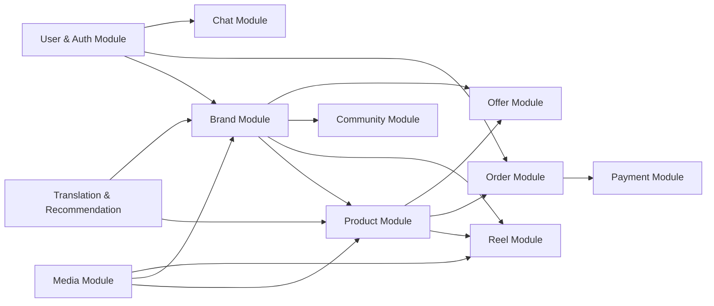

# Core Business Modules

The ReelsCommerceSystem is decomposed into ten business modules, each with clearly defined boundaries, entities, services, and controllers. The modular decomposition follows domain-driven design principles where aggregates and bounded contexts govern the separation.

## 1. User and Authentication Module

### 1.1 Module Boundary
This module manages user identity, registration, login, password management, OTP verification, and session lifecycle. It spans the `User` aggregate and supporting value objects.

### 1.2 Key Classes

**Entities:**
- `User` (`Domain/Entities/UserEntities/User.cs:13`) — Extends `IdentityUser` with `DisplayName`, `ImageURL`, `FirstName`, `LastName`, `Gender`, `DateOfBirth`, `IsBanned`, `Otp`, and navigation collections for orders, reviews, interests, follows, likes, views, comments, notifications, and brand ownership.
- `Address` (`Domain/Entities/UserEntities/Address.cs:7`) — Owned by `User` via `ShippingAddresses` collection; stores `Name`, `Street`, `City`, `Country`, `Postcode`, `PhoneNumber`, `IsDefault`.
- `Otp` (`Domain/Entities/UserEntities/Otp.cs:7`) — Owned value type with `Code`, `CreatedAt`, computed `IsValid` (10-minute window), and `CanResend` (1-minute cooldown).
- `Notification` (`Domain/Entities/UserEntities/Notification.cs:12`) — Stores bilingual messages (`Message`, `MessageAr`), `NotificationType` enum, `ReferenceId`, and `IsRead` flag.

**Services:**
- `IAuthenticationService` → `AuthenticationService` (`Infrastructure/Services/AuthenticationService.cs`) — Handles `LoginAsync`, `RegisterAsync`, `CheckEmailAsync`, `SignOutAsync`.
- `IJWTService` → `JWTService` — Generates JWT tokens for authenticated users.
- `IOtpService` → `OtpService` — Sends OTP via email and validates codes.
- `ITokenBlacklistService` → `TokenBlacklistService` — Manages a blacklist of revoked JWT tokens stored in memory (`ConcurrentDictionary`).
- `IUserInfoService` → `UserInfoService` — Retrieves authenticated user profile.
- `IUserProfileService` → `UserProfileService` — Updates user profile fields, avatar upload.

**Controller:** `AuthController` (`Api/Controllers/AuthController.cs:10`) — Exposes endpoints: `POST Login`, `POST Register`, `GET CheckEmail`, `POST SignOut`, `GET UserInfo`, `POST ForgetPassword`, `POST ResetPassword`, `GET UserInterests`.

### 1.3 Registration Flow Trace
```
POST /api/Auth/Register [FromForm]
  → ValidationActionFilter.OnActionExecuting (ModelState check)
  → AuthController.Register()
    → IAuthenticationService.RegisterAsync(RegisterReqDto)
      → Check email uniqueness via UserManager.FindByEmailAsync
      → Create User via UserManager.CreateAsync
      → Assign "Customer" role via UserManager.AddToRoleAsync
      → Generate JWT via IJWTService.GenerateToken()
      → Return RegisterResDto (token, user info)
  → ApiResponse<RegisterResDto>.SuccessResponse()
```

## 2. Brand Module

### 2.1 Module Boundary
Covers brand registration, verification, rejection, approval lifecycle, brand reviews, brand following, and brand public profile.

### 2.2 Key Classes

**Entities:**
- `Brand` (`Domain/Entities/BrandEntities/Brand.cs:7`) — Central aggregate with `DisplayName`, `Description`, `LogoUrl`, `ReturnPolicyAsHtml`, `Status` (BrandStatus enum), `CurrentStep` (BrandStep enum), `AverageRating`, `NumOfReviews`, `Category`, `Country`, `Governorate`, `District`, `NumberOfEmployees`.
- `BrandVerification` (`Domain/Entities/BrandEntities/BrandVerification.cs:10`) — One-to-one with `Brand`; stores `FullName`, `NationalId`, `TaxNumber`, identity document image URLs, `PhoneNumber`.
- `RejectionReason` (`Domain/Entities/BrandEntities/RejectionReason.cs:7`) — Reusable lookup with `Code` and `Description`.
- `BrandReview` (`Domain/Entities/BrandEntities/BrandReview.cs:7`) — User-submitted rating (`Rating`, `Comment`) with like/dislike tracking.
- `UserBrandFollow` (`Domain/Entities/BrandEntities/UserBrandFollow.cs:7`) — Many-to-many relationship between users and brands with `FollowedAt` timestamp.

**Services:**
- `IBrandService` → `BrandService` — `CreateBrandAsync`, `GetBrandInfoAsync`, `GetBrandPolicyAsync`, `ToggleFollowAsync`, `AddOrUpdateReview`, `BrandReviewLikeAsync`, `BrandReviewDislikeAsync`, `GetAverageRating`, `GetMyBrandAsync`, `GetBrandStatusAsync`.
- `IBrandVerificationService` → `BrandVerificationService` — `VerifyBrandAsync` (upload ID images to Cloudinary, create `BrandVerification` record).
- `IAdminBrandService` → `AdminBrandService` — `GetPendingAsync`, `GetDetailsAsync`, `ApproveAsync`, `RejectAsync`, `BanUserAsync`.
- `IRejectionReasonService` → `RejectionReasonService` — CRUD for rejection reasons.

**Controllers:**
- `BrandController` — Public brand profile, reviews, follows.
- `BrandVerificationController` — Identity verification document upload.
- `AdminBrandController` — Admin brand request management.
- `AdminController` — Admin authentication and dashboard.

### 2.3 Brand Approval Flow Trace
```
POST /api/BrandVerification/verify [Authorize]
  → BrandVerificationController.VerifyBrand()
    → IBrandVerificationService.VerifyBrandAsync()
      → Validate with FluentValidation (VerifyBrandRequestValidator)
      → Upload ID front/back + selfie to Cloudinary
      → Create BrandVerification entity
      → Update Brand.Status = PENDING_APPROVAL, Brand.CurrentStep = PENDING_REVIEW
      → Return success response

... Admin reviews pending brands ...

GET /api/admin/brand-requests
  → AdminBrandController.GetPending()
    → IAdminBrandService.GetPendingAsync()
      → Specification: GetPendingBrandsSpec (Status == PENDING_APPROVAL)
      → Return list with verification details

POST /api/admin/brand-requests/{id}/approve
  → AdminBrandController.Approve(id)
    → IAdminBrandService.ApproveAsync()
      → Load Brand with BrandVerification via GetBrandDetailsSpec
      → Set Brand.Status = APPROVED, Brand.CurrentStep = COMPLETED
      → Assign "BrandOwner" role to Brand.User
      → Create notification for brand owner
      → SaveChangesAsync
```

## 3. Product Module

### 3.1 Module Boundary
Product catalogue management including creation, editing, image management, categorisation, colour/size variants, product information, and pricing.

### 3.2 Key Classes

**Entities:**
- `Product` (`Domain/Entities/Products/Product.cs:7`) — Core aggregate with `Name`, `Description` (bilingual), `Price`, `DiscountPercentage`, `Rating`, `IsCustomizable`, `BrandId`, `CategoryId`.
- `ProductCategory` — `Name`, `ArName`, `ImageUrl`.
- `ProductImage` — `Url`, `PublicId` (Cloudinary reference).
- `ProductColor` — Reference entity with `Name`, `ArName`, `HexCode`.
- `ProductSize` — Reference entity mapped to `Size` enum.
- `ProductColorMapping` — Join entity linking `Product` → `ProductColor` with available quantities.
- `ProductSizeMapping` — Join entity linking `ProductColorMapping` → `ProductSize` with per-size quantity.
- `ProductInformation` — Dynamic key-value attributes with bilingual support (`Key`/`ArKey`, `Value`/`ArValue`), `InformationType`, and `Group` categorisation.
- `ProductReview` — User-submitted rating and comment for a product.

**Services:**
- `IProductService` → `ProductService` — `GetProductByIdAsync`, `GetProductsAsync` (with SpecParams filtering), `GetRelatedProductsAsync`.
- `IBrandProductService` → `BrandProductService` — `AddProductAsync`, `EditProductAsync`, `DeleteProductAsync`, `GetBrandProductsAsync`, `UploadImagesAsync`, `DeleteImageAsync`.

**Controllers:**
- `ProductController` — Public product listing and detail endpoints.
- `BrandProductController` — Brand owner product management (CRUD).

### 3.3 Product Retrieval Flow Trace
```
GET /api/Product?Search=...&BrandId=...&MinPrice=...&SortBy=price&SortOrder=desc&PageIndex=1&PageSize=10
  → ProductController.GetProducts([FromQuery] ProductSpecParams)
    → IProductService.GetProductsAsync(specParams)
      → Create ProductSpec(specParams) with:
          - Criteria: search, brand, price range, category, stock status, offer filter
          - Sorting: by name, price, date, discount, popularity, rating
          - Paging: PageIndex / PageSize
          - Includes: Brand, Category, Colors, Sizes, Reviews, Images
      → IGenericRepository<Product>.GetAllWithSpecAsync(spec)
      → spec.GetCountAsync(_context.Products)
      → Map to List<ProductResDto>
      → Return PaginationResponse<ProductResDto>
```

## 4. Reel Module

### 4.1 Module Boundary
Short-form video content management (Reels), including creation, feed generation, analytics, comments, likes, and product tagging.

### 4.2 Key Classes

**Entities:**
- `Reel` (`Domain/Entities/ReelEntities/Reel.cs:7`) — `VideoUrl`, `Title`, `ThumbnailUrl`, `Status` (Draft/Published), computed `NumOfLikes` and `NumOfWatches`.
- `ProductReels` — Many-to-many join between `Reel` and `Product`.
- `UserReelLike` — User like on a reel.
- `UserReelView` — User view with `WatchedDurationSeconds` and computed `WatchRatio`.
- `ReelComment` — User comment on a reel.
- `ReelCommentLove` — Like on a reel comment.
- `ReelCommentReply` — Nested replies on reel comments.
- `ReelCommentReplyLove` — Like on a reply.

**Services:**
- `IReelService` → `ReelService` — `CreateReelAsync`, `DeleteReelAsync`, `ToggleLikeAsync`, `RecordViewAsync`.
- `IReelFeedService` → `ReelFeedService` — `GetForYouFeedAsync` (FYP), `GetFollowingFeedAsync` (brand follow-based), `GetReelsByIdsAsync`.
- `IReelManagementService` → `ReelManagementService` — Brand owner's reel CRUD, product association, status management.
- `IReelCommentService` → `ReelCommentService` — Add, delete, and retrieve comments with pagination.
- `IReelAnalyticsService` → `ReelAnalyticsService` — View count and analytics retrieval.
- `IReplyService` → `ReplyService` — Add replies, toggle reply likes, paginated retrieval.

**Controllers:**
- `ReelController` — Public reel feed, likes, views.
- `ReelManagementController` — Brand's reel management.
- `ReelCommentController` — Reel comments.
- `CommentReplyController` — Nested replies.

### 4.3 Reel Feed Generation Flow Trace
```
GET /api/Reel/ForYou (or /Following)
  → ReelController.GetForYouFeed([FromQuery] int pageIndex, int pageSize)
    → IReelFeedService.GetForYouFeedAsync(pageIndex, pageSize)
      → If following feed:
          → GetUserFollowedBrandIds(userId)
          → Create ReelFeedSpec(followedBrandIds, pageIndex, pageSize) with:
              - Criteria: r => followedBrandIds.Contains(r.BrandId)
              - Includes: Brand, ReelComments, ProductReels → Product → Reviews & Images
              - OrderBy: CreatedAt descending
              - Paging applied
      → If for-you feed:
          → Create ReelFeedSpec(pageIndex, pageSize) with:
              - No criteria (all published reels)
              - Same includes and ordering
      → IGenericRepository<Reel>.GetAllWithSpecAsync(spec)
      → Map to List<ReelFeedRes>
      → Return ApiResponse<List<ReelFeedRes>>
```

## 5. Order and Checkout Module

### 5.1 Module Boundary
Shopping cart, order creation, discount code application, payment processing, order tracking, and lifecycle management.

### 5.2 Key Classes

**Entities:**
- `Cart` (`Domain/Entities/Order&ProductEntities/Cart.cs:7`) — User-owned cart with `ProductCarts` collection and `CreatedAt`.
- `Order` (`Domain/Entities/Order&ProductEntities/Order.cs:9`) — Central aggregate with `OrderStatus`, `PaymentStatus`, `PaymentMethod`, `TotalAmount`, `DiscountAmount`, shipping address fields, `PaymobOrderId`, `PaymobTransactionId`, `PaidAt`.
- `OrderProduct` — Line items with `ProductName`, `FinalPrice`, `Quantity`, `Color`, `Size`, `IsCustomized`, `ProductMediaUrls`.
- `OrderTracking` — Optional tracking with `TrackingNumber` and `Status`.
- `DiscountCode` — `Code` (unique), `UsageCount`, `ExpirationDate`, `DiscountValue`.
- `WishlistItem` — User's saved products.

**Services:**
- `ICartService` → `CartService` — `GetUserCart`, `AddToCartAsync`, `UpdateCartAsync`.
- `ICartCacheService` → `CartCacheService` — In-memory cart operations using `IMemoryCache`.
- `IOrderService` → `OrderService` — `CreateOrderAsync`, `GetOrdersForUserAsync`, `GetOrderDetailsAsync`, `CancelOrderAsync`.
- `IPaymentService` → `PaymentService` — Initiates Paymob payment, processes webhook callbacks.
- `IPaymobService` → `PaymobService` — Low-level Paymob API integration (auth token, order registration, payment key).
- `IDiscountCodeService` → `DiscountCodeService` — Validate and apply discount codes.
- `IWishlistService` → `WishlistService` — Add/remove/check wishlist items.

**Controllers:**
- `CartController` — Cart CRUD.
- `OrderController` — Order creation and management.
- `PaymentController` — Payment initiation.
- `PaymobWebhookController` — Paymob transaction callback.
- `WishlistController` — Wishlist management.
- `DiscountCodesController` — Discount code validation.

### 5.3 Order Creation Flow Trace
```
POST /api/Order [Authorize]
  → OrderController.CreateOrder([FromBody] CreateOrderReq)
    → Validated by CreateOrderReqValidator
    → IOrderService.CreateOrderAsync(userId, req)
      → Get cart from ICartService.GetUserCart(userId)
      → If discount code provided:
          → IDiscountCodeService.ValidateCode(code)
          → Apply discount: calculate DiscountAmount
      → Create Order entity with shipping address
      → Create OrderProduct entities from cart items
      → Clear cart via ICartCacheService.ClearCart(userId)
      → If PaymentMethod == Card or Wallet:
          → IPaymentService.InitiatePayment(order)
            → IPaymobService.GetAuthToken()
            → IPaymobService.CreateOrder(order, products)
            → IPaymobService.GetPaymentKey(orderId, amount)
            → Return payment URL (iframe)
      → If PaymentMethod == CashOnDelivery:
          → Set PaymentStatus = PayOnDelivery
          → Save order
      → Return CreateOrderRes with order details and payment URL
```

## 6. Chat and Real-Time Messaging Module

### 6.1 Module Boundary
One-to-one real-time messaging between users and brand owners, including room management, message status tracking, and SignalR push notifications.

### 6.2 Key Classes

**Entities:**
- `ChatRoom` (`Domain/Entities/ChatEntities/ChatRoom.cs:7`) — Two-user conversation with `User1Id`, `User2Id`.
- `Message` (`Domain/Entities/ChatEntities/Message.cs:9`) — `Text`, `ImageUrl`, `Status` (Pending/DeliveredToServer/Delivered/Seen), `RoomId`, `SenderId`.

**Services:**
- `IChatRoomService` → `ChatRoomService` — `CreateRoom`, `GetUserRooms`, `GetRoomRes`, `GetUnreadCount`, `DeleteRoom`.
- `IChatService` → `ChatService` — `SendMessageAsync`, `GetMessagesAsync`, `DeleteMessageAsync`, `DeleteAllMessagesAsync`.
- `IChangeMessageStatusService` → `ChangeMessageStatusService` — Update message status from Pending → Delivered → Seen.
- `IChatSender` → `ChatSender` (Api layer) — SignalR hub proxy for real-time notifications.

**Hubs:**
- `ChatHub` (`Api/SignalR/Hubs/ChatHub.cs`)
- `NotificationHub` (`Api/SignalR/Hubs/NotificationHub.cs`)

**Controller:** `ChatController` — REST endpoints for rooms, messages, status updates.

### 6.4 Message Delivery Flow Trace
```
Client sends message:
  POST /api/Chat/message [Authorize]
    → ChatController.SendMessage(SendMessageReq)
      → IChatService.SendMessageAsync(userId, dto)
        → Validate room membership
        → Create Message entity with Status = Pending
        → Save to database
        → Return MessageRes
    → ApiResponse<MessageRes>.SuccessResponse

Real-time delivery:
  On message save → ChatSender.SendMessage(recipientId, messageRes)
    → ChatHub.Clients.User(recipientId).SendAsync("ReceiveMessage", messageRes)

Recipient reads → status update:
  POST /api/Chat/status [Authorize]
    → ChatController.ChangeMessageStatus(ChangeMessageStatusReq)
      → IChangeMessageStatusService.ChangeStatusAsync(userId, roomId, "Seen", messageIds)
        → Decrypt message IDs
        → Update Message.Status = Seen for owned messages
        → Notify sender via ChatSender.MessageStatusChanged(...)
```

## 7. Community Module

### 7.1 Module Boundary
Brand community management including blog-style posts, comments, likes, and engagement features.

### 7.2 Key Classes

**Entities:**
- `CommunityPost` — `Title`, `Slug`, `Content`, `CoverImageUrl`, `Status` (Draft/Published), `CommentsEnabled`, `BrandId`.
- `PostComment` — Comment on community posts with nested replies (`ParentCommentId`).
- `PostLike` — Brand like on a post.
- `PostCommentLike` — Brand like on a comment.

**Services:**
- `ICommunityService` → `CommunityService` — `CreatePostAsync`, `GetPostAsync`, `GetPostsAsync`, `EditPostAsync`, `DeletePostAsync`, `TogglePostLikeAsync`, `AddCommentAsync`, `DeleteCommentAsync`, `ToggleCommentLikeAsync`.
- `IPostCommentService` → `PostCommentService` — Comment-specific operations.

**Controller:** `CommunityController` — Full REST API for community features.

## 8. Offer Module

### 8.1 Module Boundary
Time-limited promotional offers that bundle products with discount percentages.

### 8.2 Key Classes

**Entities:**
- `Offer` (`Domain/Entities/OfferEntities/Offer.cs:7`) — `Description`, `DiscountPercentage`, `ImageUrl`, `PublicId`, `BrandId`.
- `OfferProduct` — Composite key join (`OfferId`, `ProductId`) linking offers to products.

**Services:**
- `IOfferService` → `OfferService` — CRUD for offers, today's offers, recent offers.
- `ITodayOfferService` → (via `TodayOfferController`).

**Controllers:**
- `TodayOfferController` — Today's active offers.
- `OfferController` (via brand product routes).

## 9. Media and Storage Module

### 9.1 Module Boundary
File upload, image/video processing, and cloud storage management through Cloudinary.

### 9.2 Key Classes

**Services:**
- `ICloudinaryService` → `CloudinaryService` — Upload photos and videos with transformation, delete by public ID.
- `IPhotoServive` → `PhotoService` — Photo-specific upload with Cloudinary upload presets.
- `IFileStorageService` → `FileStorageService` — Local file storage for video uploads.
- `IUserImageService` → `UserImageService` — User avatar management.

**Controller:** `MediaController` — Video upload endpoints.

## 10. Translation and Recommendation Module

### 10.1 Module Boundary
External AI-powered services for content translation and product recommendation.

### 10.2 Key Classes

**Services:**
- `ITranslationService` → `GeminiTranslationService` — Uses Google Gemini API to translate product descriptions and content between English and Arabic.
- `IRecommendationService` → `RecommendationService` — Calls external microservice at `https://recommendation.ai.alluvo.life` to retrieve personalised product recommendations.
- `ISearchService` → `SearchService` — Unified search across products, brands, and reels.

**Controller:**
- `TranslationController` — Translation endpoints.
- `SearchController` — Search endpoints.

## 11. Module Dependency Graph



Each module communicates through the defined service interfaces in the Application layer. Cross-module dependencies (e.g., Order referencing Cart and Product) occur through interface abstractions, ensuring that no concrete implementation details leak across module boundaries.
