# Database Design

## 1. ORM and Configuration

The data access layer is built on **Entity Framework Core 9.0.9** with the **SQL Server** provider. The `AppDbContext` class (`Infrastructure.Infrastructure/Persistence/AppDbContext.cs:23`) extends `IdentityDbContext<User>`, integrating ASP.NET Core Identity tables directly into the application schema.

### 1.1 DbContext Configuration

The `AppDbContext` is configured in `AddApplicationDBConfig` (`Api/DependencyInjectionExtensions/AddApplicationDatabaseConfig.cs:13`), which selects the connection string based on the `ASPNETCORE_ENVIRONMENT` variable:

| Environment | Connection String Key |
|---|---|
| Development | `DevelopmentDB` |
| Staging | `StagingDB` |
| Production | `ProductionDB` |

Query tracking is disabled globally (`QueryTrackingBehavior.NoTracking`) for read-only queries, with explicit tracking enabled only when entities are attached for update or delete operations.

### 1.2 Entity Configuration Approach

Entity configurations are applied through `modelBuilder.ApplyConfigurationsFromAssembly(Assembly.GetExecutingAssembly())` (`AppDbContext.cs:45`), which scans for all `IEntityTypeConfiguration<T>` implementations. Additional relationships and constraints are configured directly in `OnModelCreating` for clarity.

## 2. Entity Relationship Diagram

### 2.1 Complete ERD (Mermaid)

```mermaid
erDiagram
    Users ||--o{ Addresses : "has"
    Users ||--o{ Orders : "places"
    Users ||--o{ ProductReviews : "writes"
    Users ||--o{ UserInterests : "has"
    Users ||--o{ UserBrandFollows : "follows"
    Users ||--o{ WishlistItems : "saves"
    Users ||--o{ UserReelLikes : "likes"
    Users ||--o{ UserReelViews : "views"
    Users ||--o{ ReelComments : "comments"
    Users ||--o{ ReelCommentLoves : "loves"
    Users ||--o{ ReelCommentReplyLoves : "loves"
    Users ||--o{ UserProductViews : "views"
    Users ||--o{ Notifications : "receives"
    Users ||--|| Brand : "owns"
    Users ||--o{ ChatRooms : "participates"
    Users ||--o{ Messages : "sends"

    Brand ||--o{ Products : "has"
    Brand ||--o{ BrandReviews : "receives"
    Brand ||--o{ UserBrandFollows : "followed_by"
    Brand ||--o{ Reels : "creates"
    Brand ||--o{ Offers : "promotes"
    Brand ||--o{ CommunityPosts : "publishes"
    Brand ||--o{ PostComments : "writes"
    Brand ||--o{ PostLikes : "likes"
    Brand ||--o{ PostCommentLikes : "likes"
    Brand }o--|| RejectionReason : "may_have"
    Brand ||--|| BrandVerification : "verified_by"

    ProductCategory ||--o{ Products : "categorises"
    Product ||--o{ ProductImages : "has"
    Product ||--o{ ProductReviews : "has"
    Product ||--o{ ProductColorMappings : "has_colors"
    Product ||--o{ ProductInformations : "has_info"
    Product ||--o{ ProductReels : "featured_in"
    Product ||--o{ OrderProducts : "ordered_in"
    Product ||--o{ WishlistItems : "wished_in"
    Product ||--o{ UserProductViews : "viewed_by"
    Product ||--o{ OfferProducts : "discounted_in"

    ProductColorMappings ||--o{ ProductSizeMappings : "has_sizes"
    ProductColorMappings }o--|| ProductColor : "color"
    ProductSizeMappings }o--|| ProductSize : "size"

    Offer ||--o{ OfferProducts : "includes"
    Reel ||--o{ ProductReels : "showcases"
    Reel ||--o{ UserReelLikes : "liked_by"
    Reel ||--o{ UserReelViews : "viewed_by"
    Reel ||--o{ ReelComments : "has_comments"
    
    ReelComments ||--o{ ReelCommentLoves : "has_loves"
    ReelComments ||--o{ ReelCommentReplies : "has_replies"
    ReelCommentReplies ||--o{ ReelCommentReplyLoves : "has_loves"

    CommunityPost ||--o{ PostComments : "has"
    CommunityPost ||--o{ PostLikes : "has"
    PostComments ||--o{ PostCommentLikes : "has"
    PostComments ||--o{ PostComments : "replies_to"

    Order ||--o{ OrderProducts : "contains"
    Order ||--o| OrderTrackings : "has_tracking"
    Order }o--|| DiscountCode : "may_use"

    ChatRoom ||--o{ Messages : "contains"

    Interest ||--o{ UserInterests : "selected_by"

    UserInterests }o--|| Interests : "interest"
    UserInterests }o--|| Users : "user"
```



### 2.2 Identity Tables

The following ASP.NET Core Identity tables are integrated with custom table names configured in `AppDbContext.OnModelCreating`:

| Identity Table | Custom Name | Entity |
|---|---|---|
| `AspNetUsers` | `Users` | `User` |
| `AspNetRoles` | `Roles` | `IdentityRole` |
| `AspNetUserRoles` | `UserRoles` | `IdentityUserRole<string>` |
| `AspNetUserClaims` | `UserClaims` | `IdentityUserClaim<string>` |
| `AspNetUserLogins` | `UserLogins` | `IdentityUserLogin<string>` |
| `AspNetRoleClaims` | `RoleClaims` | `IdentityRoleClaim<string>` |
| `AspNetUserTokens` | `UserTokens` | `IdentityUserToken<string>` |

## 3. Key Relationships and Constraints

### 3.1 Delete Behavior Conventions

The database employs a mix of cascade and restrict delete behaviours to maintain referential integrity:

**Cascade Delete** (parent deletion propagates to children):
- `ReelComment` → `Reel` (when a reel is deleted, its comments are deleted)
- `ReelCommentLove` → `ReelComment`
- `ReelCommentReply` → `ReelComment` (parent comment deletion cascades to replies)
- `ReelCommentReplyLove` → `ReelCommentReply`
- `Message` → `ChatRoom`
- `Notification` → `User`
- `BrandVerification` → `Brand`

**Restrict Delete** (prevents parent deletion if children exist):
- `ReelComment` → `User`
- `ReelCommentLove` → `User`
- `ReelCommentReplyLove` → `User`
- `Message` → `Sender` (User)
- `ChatRoom` → `User1`, `User2`
- `Offer` → `Brand`

**SetNull Delete**:
- `Brand` → `RejectionReason` (when a rejection reason is deleted, brand's `RejectionReasonId` is set to null)

### 3.2 Unique Constraints

- `Brand.UserId` — One-to-one relationship between Brand and User (enforced by unique index)
- `BrandReview` on `(BrandId, UserId)` — Users can submit only one review per brand
- `ReelCommentLove` on `(ReelCommentId, UserId)` — Users can love a comment only once
- `ReelCommentReplyLove` on `(ReelCommentReplyId, UserId)` — Users can love a reply only once
- `DiscountCode.Code` — Discount codes must be unique

### 3.3 Decimal Precision

Monetary and percentage values use explicit precision to avoid rounding errors:

| Entity Property | Precision |
|---|---|
| `DiscountCode.DiscountValue` | (18, 2) |
| `OrderProduct.AppliedDiscountCodeAmount` | (18, 2) |
| `Offer.DiscountPercentage` | (18, 2) |

### 3.4 Composite Keys

- `OfferProduct` — Composite primary key: `(OfferId, ProductId)`

## 4. Indexing Strategy

### 4.1 Primary Keys
All entities inherit `BaseEntity` with `int Id` as the primary key (auto-increment). The `User` entity uses `string Id` (GUID) inherited from `IdentityUser`.

### 4.2 Foreign Key Indexes
EF Core automatically creates indexes for all foreign key columns, including:
- `Product.BrandId`, `Product.CategoryId`
- `Order.UserId`
- `Reel.BrandId`
- `Offer.BrandId`
- `CommunityPost.BrandId`
- `ChatRoom.User1Id`, `ChatRoom.User2Id`
- `Message.RoomId`, `Message.SenderId`

### 4.3 Unique Indexes
As specified in Section 3.2, unique indexes are explicitly created:
- `IX_Brand_UserId` (unique)
- `IX_BrandReview_BrandId_UserId` (unique)
- `IX_ReelCommentLove_ReelCommentId_UserId` (unique)
- `IX_ReelCommentReplyLove_ReelCommentReplyId_UserId` (unique)
- `IX_DiscountCode_Code` (unique)

## 5. Concurrency and Auditing

The `AppDbContext.SaveChangesAsync` override (`AppDbContext.cs:253`) automatically manages audit timestamps:
- On `EntityState.Added`: sets `CreatedAt` and `UpdatedAt` to `DateTime.UtcNow`
- On `EntityState.Modified`: sets `UpdatedAt` to `DateTime.UtcNow`

This is applied uniformly to all entities inheriting from `BaseEntity`, ensuring consistent audit trail across the entire database.

## 6. Migrations

As of the latest migration (`20260510212412_EnsureAllUsersHaveUserRole`), the database has 18 EF Core migrations applied:

| Migration | Description |
|---|---|
| `20260424163803_updatedChatEntities` | Chat entities initial schema |
| `20260425153149_CreateMessageAndChatRoom` | Message and ChatRoom creation |
| `20260425232023_ProductSeeding` | Seed product data |
| `20260430124919_AddImageUrlForCategory` | Add ImageUrl to ProductCategory |
| `20260506150404_EditReel(status,ThumbnailUrl)` | Reel status and thumbnail |
| `20260506173313_AddDiscountCodeModule` | DiscountCode entity |
| `20260506181834_FixOrderProductPrecision` | Decimal precision fix |
| `20260506191916_EditProduct(rating)` | Rating field on Product |
| `20260507200729_AdminLoginTable` | Admin login support |
| `20260508214025_SeedingViewsForReelId51` | Seed reel view data |
| `20260509111801_UpdatedProductImageEntity` | ProductImage updates |
| `20260509162244_UpdatatedOfferEntity` | Offer entity updates |
| `20260509163534_UpdatatedOfferEntityUrl` | Offer URL field |
| `20260509170353_AddedDiscountPercentageToOfferEntity` | Discount percentage on Offer |
| `20260509181808_CommunityEntities` | Community module tables |
| `20260509211157_EditCommunityEntities` | Community entity refinements |
| `20260510202430_SeedRolesAndUserRoles` | Role seeding |
| `20260510205819_AssignBrandOwnerRolesToExistingOwners` | BrandOwner role assignment |
| `20260510210928_AssignBrandOwnerRoleToBrandOwners` | Role assignment fix |
| `20260510212412_EnsureAllUsersHaveUserRole` | Default User role for all users |

### 6.1 Automatic Migration Application

On application startup, `AppMiddlewareExtentions.AddAppMiddleware` (`Api/Middlewares/MiddlewaresExtensions/AppMiddlewareExtentions.cs:36`) automatically applies pending migrations:
```csharp
using (var scope = app.Services.CreateScope())
{
    var dbContext = scope.ServiceProvider.GetRequiredService<AppDbContext>();
    dbContext.Database.Migrate();
}
```

## 7. Specification-Based Query System

### 7.1 Specification Pattern Overview

The `Specification<T>` class (`Infrastructure.Infrastructure/Specifications/Common/Specification.cs:10`) encapsulates query logic including:
- **Criteria** — `Expression<Func<T, bool>>` for WHERE clauses
- **Includes** — Eager loading via `Include` and `ThenInclude`
- **IncludeChains** — Complex multi-level include chains
- **OrderBy / OrderByDescending** — Sorting expressions
- **Paging** — `PageIndex` and `PageSize` for Skip/Take
- **QueryModifiers** — Additional query transformations (e.g., `AsSplitQuery()`)
- **Logical Operators** — `&` (AND), `|` (OR), `!` (NOT) for composing specifications

The `SpecificationEvaluator<T>` (`Infrastructure.Infrastructure/Specifications/Common/SpecificationEvaluator.cs:8`) applies the specification to an `IQueryable<T>` in order: Criteria → Includes → IncludeStrings → IncludeChains → OrderBy → Paging → QueryModifiers.

### 7.2 Pagination Specification Example

```csharp
public class ProductSpec : Specification<Product>
{
    public ProductSpec(ProductSpecParams specParams)
    {
        // Criteria: search, brand, price, category, stock, offer, color, size filters
        // Includes: Brand, Category, Colors, Sizes, Reviews, Images
        // Sorting: name, price, date, discount, popularity, rating
        // Paging: PageIndex, PageSize
        // QueryModifiers: AsSplitQuery()
    }
}
```

Usage in repository:
```csharp
var spec = new ProductSpec(specParams);
var products = await _productRepository.GetAllWithSpecAsync(spec);
var totalCount = await spec.GetCountAsync(_context.Products);
```
