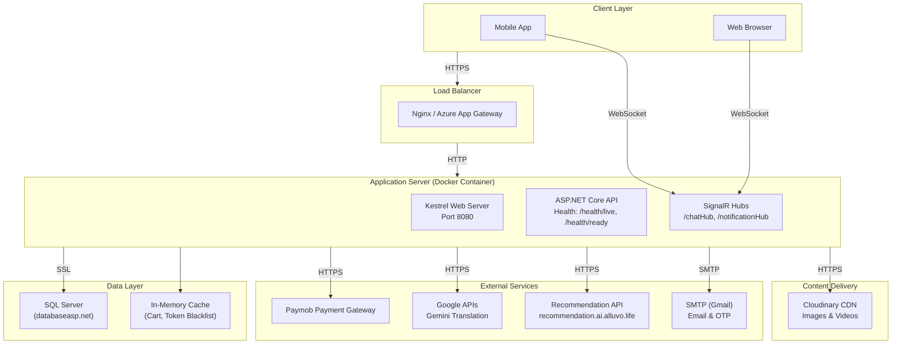

# Performance and Deployment

## 1. Asynchronous Programming Model

The entire codebase follows the **asynchronous programming model** using `async`/`await` throughout the call stack:

- **Controllers** — All action methods return `Task<IActionResult>` or `Task<ActionResult<T>>`, ensuring no thread-blocking during I/O operations.
- **Services** — All service interface methods are async, delegating to async repository methods.
- **Repositories** — `GenericRepository<T>` uses `ToListAsync()`, `FirstOrDefaultAsync()`, `FindAsync()`, `CountAsync()`, and `SaveChangesAsync()` exclusively.
- **DbContext** — `SaveChangesAsync()` is overridden to automatically set audit timestamps before persisting.

This non-blocking architecture allows the server to handle a large number of concurrent requests with a minimal thread pool, as threads are released back to the pool during I/O wait times (database queries, external HTTP calls, file storage operations).

## 2. Performance Optimisation Strategies

### 2.1 Query Tracking Behaviour

The `AppDbContext` (`Infrastructure.Infrastructure/Persistence/AppDbContext.cs:29`) disables change tracking globally:

```csharp
optionsBuilder.UseQueryTrackingBehavior(QueryTrackingBehavior.NoTracking);
```

This eliminates the overhead of the change tracker for read queries. Entities are explicitly attached only when updates or deletes are performed, significantly reducing memory usage and improving query performance.

### 2.2 Split Query Optimisation

Specifications use `AsSplitQuery()` for queries involving multiple eager-loaded collections to avoid Cartesian explosion:

```csharp
protected void AsSplitQuery()
{
    QueryModifiers.Add(q => q.AsSplitQuery());
}
```

Entities like `Product` with multiple collection navigations (`AvailableColors`, `Reviews`, `Images`, `ProductInformations`) use split queries extensively to generate efficient separate SQL statements rather than a single massive `JOIN`.

### 2.3 Specification-Based Query Optimisation

The `SpecificationEvaluator<T>` composes queries efficiently by:
- Applying `WHERE` criteria before `JOIN` operations to reduce intermediate result sets
- Using `Include` strings for multi-level navigation properties
- Applying pagination (`Skip/Take`) as the final operation before query execution
- Ordering only when sorting is specified

### 2.4 In-Memory Caching

**Cart Cache:** `CartCacheService` (`Infrastructure/Services/CartCacheService.cs`) uses `IMemoryCache` for cart operations, reducing database round-trips for frequently accessed cart data. The cart is stored as a serialised JSON string in memory, keyed by user ID.

### 2.5 Connection Pooling

SQL Server connection pooling is leveraged through the default ADO.NET connection pooling behaviour. The connection string `MultipleActiveResultSets=True` enables MARS, allowing multiple queries on the same connection.

### 2.6 Decimal Precision

Monetary and percentage values use `HasPrecision(18, 2)` to optimise storage and avoid rounding errors, as specified in the `AppDbContext` configuration.

## 3. Scalability Considerations

### 3.1 Stateless API Design

All controllers are stateless — no session state or server-side UI state is maintained. Authentication state is carried in JWT tokens, enabling horizontal scaling by adding more server instances behind a load balancer.

### 3.2 SignalR Backplane Considerations

The current SignalR implementation uses in-memory hub state, which limits horizontal scaling. For multi-instance deployments, a SignalR backplane (Azure SignalR Service, Redis backplane) would be required to distribute real-time messages across servers.

### 3.3 Database Scaling

The SQL Server database can be scaled vertically (more powerful hardware) or horizontally through read replicas. The use of `NoTracking` queries makes read-replica routing straightforward.

### 3.4 External Service Dependencies

The system depends on several external services:
- **Paymob** — Payment gateway (critical path)
- **Cloudinary** — Media upload and delivery
- **Gemini API** — Content translation
- **Recommendation Service** — Personalised recommendations
- **SMTP Server** — Email delivery

These dependencies are called via `HttpClient` (with `AddHttpClient<T>`) and are configured with appropriate timeouts (Recommendation Service: 10 seconds).

## 4. Docker Deployment

### 4.1 Dockerfile

The multi-stage Dockerfile (`Dockerfile`) builds and publishes the API using the official .NET SDK and ASP.NET runtime images:

- **Build Stage:** `mcr.microsoft.com/dotnet/sdk:9.0`
  - Copies project files and restores dependencies (layer caching optimisation)
  - Builds in Release configuration
- **Publish Stage:** Same image, runs `dotnet publish`
- **Runtime Stage:** `mcr.microsoft.com/dotnet/aspnet:9.0`
  - Installs `curl` for health check support
  - Copies published output
  - Exposes port 8080
  - Configures `HEALTHCHECK` via `curl http://localhost:8080/health/live`

### 4.2 Container Configuration

```dockerfile
# Kestrel configuration is handled in Program.cs
builder.WebHost.ConfigureKestrel(options =>
{
    options.Limits.MaxRequestBodySize = 209715200; // 200MB for video uploads
});
```

The `ASPNETCORE_URLS` and `ASPNETCORE_ENVIRONMENT` environment variables are intended to be set via Docker Compose or Kubernetes manifests (currently commented out in the Dockerfile).

## 5. Health Checks

Three health check endpoints provide observability:

| Endpoint | Implementation |
|---|---|
| `/health/live` | Simple liveness — always returns healthy (`tag: "live"`) |
| `/health/ready` | Readiness — checks database connectivity via `AddDbContextCheck` (`tag: "ready"`) |
| `/health/details` | Detailed report — uses `UIResponseWriter.WriteHealthCheckUIResponse` |

Health checks are registered in `Program.cs`:
```csharp
builder.Services.AddHealthChecks()
    .AddCheck("self", () => HealthCheckResult.Healthy(), ["live"])
    .AddDbContextCheck<AppDbContext>(name: "database", tags: ["ready"]);
```

## 6. Observability and Logging

### 6.1 Structured Logging with Serilog

Serilog is configured in `Program.cs` (`builder.Host.AddSerilog(builder.Configuration)`) with:
- **Minimum Level:** Information (Warning for `Microsoft` and `System`)
- **Enrichers:** `FromLogContext`
- **Sink:** Console (structured JSON output)
- **Request Logging:** `app.UseSerilogRequestLogging()` logs incoming requests and their duration

The `ExceptionHandlingMiddleware` logs all unhandled exceptions at `LogLevel.Error` with the full exception message.

### 6.2 Logging Configuration (appsettings.json)

```json
"Serilog": {
  "MinimumLevel": {
    "Default": "Information",
    "Override": {
      "Microsoft": "Warning",
      "System": "Warning"
    }
  },
  "Enrich": [ "FromLogContext" ],
  "WriteTo": [{ "Name": "Console" }]
}
```

## 7. CI/CD and GitHub Workflow

### 7.1 Branch Strategy

The project follows a Git Flow-inspired branching model:
- `master` — Production (restricted)
- `staging` — Pre-production (read-only)
- `development` — Main integration branch
- `Feature/*` and `Bug/*` — Developer feature branches

### 7.2 Build Pipeline

The `.github/` directory contains GitHub Actions workflow configuration for automated builds and deployment.

## 8. Environment Configuration

### 8.1 ASPNETCORE_ENVIRONMENT

The system supports three environments:
- **Development** — Local development, uses `DevelopmentDB` connection string
- **Staging** — Pre-production testing, uses `StagingDB` connection string
- **Production** — Production deployment, uses `ProductionDB` connection string

### 8.2 Configuration Sources (Priority Order)

1. `appsettings.json` (base configuration)
2. `appsettings.{Environment}.json` (environment-specific overrides)
3. Environment variables (for production secrets and connection strings)
4. Docker secrets / Azure Key Vault (in production)

## 9. Deployment Architecture Diagram



The deployment architecture follows a standard containerised microservice pattern: a Docker container running the .NET 9.0 application behind a reverse proxy/load balancer, connecting to an external SQL Server database (databaseasp.net), with Cloudinary for media CDN and Paymob for payment processing.
