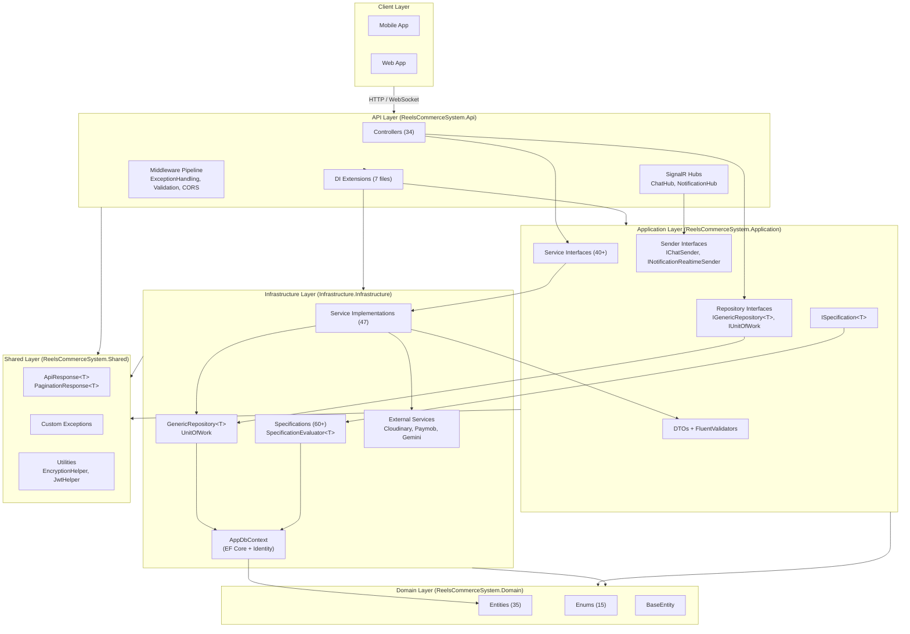

# System Architecture

## 1. Architectural Style — Clean Architecture

The ReelsCommerceSystem backend is implemented using the **Clean Architecture** pattern (also referred to as Onion Architecture), which enforces a strict separation of concerns through concentric layers. The solution comprises five discrete .NET 9.0 projects organised as follows:

- **ReelsCommerceSystem.Domain** — Innermost layer containing enterprise-wide business entities, enumerations, and the `BaseEntity` abstract class (`ReelsCommerceSystem.Domain/Common/BaseEntity.cs:5`). This layer has zero external dependencies except for `MailKit`, `Microsoft.EntityFrameworkCore.Abstractions`, and `Microsoft.Extensions.Identity.Stores` (for the `IdentityUser` base class).
- **ReelsCommerceSystem.Shared** — Contains cross-cutting concerns: custom exception types (`NotFoundException`, `BadRequestException`, `UnauthorizedException`, `UserNotFoundException`), standardised API response wrappers (`ApiResponse<T>`, `PaginationResponse<T>`), and utility helpers (`EncryptionHelper`, `JwtHelper`, `FileHelper`, `Email`). Referenced by all other layers.
- **ReelsCommerceSystem.Application** — The use-case layer housing service interfaces (e.g., `IAuthenticationService`, `IOrderService`, `IReelService`), repository interfaces (`IGenericRepository<T>`, `ISpecification<T>`), DTOs, FluentValidation validators, and custom attributes (`AllowedImageExtensionsAttribute`, `RequiredWithArabicAttribute`). Depends only on `Domain` and `Shared`.
- **ReelsCommerceSystem.Infrastructure** (at `Infrastructure.Infrastructure/`) — Implements all interfaces declared in the Application layer: concrete `GenericRepository<T>`, `UnitOfWork`, the `Specification<T>` base class with its `SpecificationEvaluator<T>`, all service implementations (47 classes), the `AppDbContext` (Entity Framework Core), and Cloudinary media integration. Depends on `Application`, `Domain`, and `Shared`.
- **ReelsCommerceSystem.Api** — The presentation layer exposing RESTful endpoints via ASP.NET Core MVC controllers, SignalR hubs (`ChatHub`, `NotificationHub`), middleware (`ExceptionHandlingMiddleware`), dependency injection extension methods, and OpenAPI/Swagger configuration. This is the composition root where all dependencies are wired.

Layered architecture ensures that dependencies point **inward**: the Api layer references Infrastructure, Application, and Shared; Infrastructure references Application, Domain, and Shared; Application references only Domain and Shared. The Domain layer has no project references to any other layer.

## 2. Solution Structure and Project Organisation

The solution file `ReelsCommerceSystem.sln` organises projects into solution folders:

```
Solution Folders:
  Api/
    ReelsCommerceSystem.Api
  Application/
    ReelsCommerceSystem.Application
  Domain/
    ReelsCommerceSystem.Domain
  Infrastructure/
    ReelsCommerceSystem.Infrastructure
  Shared/
    ReelsCommerceSystem.Shared
```

Within each project, namespaces mirror folder structure:

- **Controllers** — `ReelsCommerceSystem.Api.Controllers`
- **Services** — `ReelsCommerceSystem.Infrastructure.Services`
- **Repositories** — `ReelsCommerceSystem.Infrastructure.Repositories`
- **Persistence** — `ReelsCommerceSystem.Infrastructure.Persistence`
- **Specifications** — `ReelsCommerceSystem.Infrastructure.Specifications.Common` and `...Specifications.Specifications.*`
- **DTOs** — `ReelsCommerceSystem.Application.DTOs.Request.{Module}` and `...DTOs.Response.{Module}`
- **Entities** — `ReelsCommerceSystem.Domain.Entities.{Module}Entities`

## 3. Technology Stack

### 3.1 Runtime and Framework
- **.NET 9.0** SDK and ASP.NET Core 9.0 runtime
- **C# 13** with nullable reference types and implicit usings enabled

### 3.2 Data Access
- **Entity Framework Core 9.0.9** with SQL Server provider
- **Microsoft.AspNetCore.Identity.EntityFrameworkCore 9.0.9** for ASP.NET Core Identity
- **EF Core Proxies** (lazy loading enabled via `Microsoft.EntityFrameworkCore.Proxies`)
- **EF Core InMemory** (8.0.21) used for development/testing scenarios

### 3.3 Authentication and Authorisation
- **Microsoft.AspNetCore.Authentication.JwtBearer 9.0.9** for JWT-based authentication
- **ASP.NET Core Identity** with custom `User` entity extending `IdentityUser`
- Token blacklisting mechanism (`ITokenBlacklistService` / `TokenBlacklistService`)

### 3.4 Real-Time Communication
- **ASP.NET Core SignalR** with two hubs: `ChatHub` and `NotificationHub`
- Hub paths mapped at `/chatHub` and `/notificationHub`

### 3.5 Media and Cloud Services
- **CloudinaryDotNet 1.27.8** for image and video upload management
- **MailKit 4.16.0** for SMTP email delivery (OTP, notifications)

### 3.6 API Documentation
- **Swashbuckle.AspNetCore 9.0.4** with OpenAPI 3.0 document generation
- Custom document transformers for JWT Bearer security scheme

### 3.7 Validation
- **FluentValidation 12.1.1** for request DTO validation
- Custom `ValidationActionFilter` implementing `IActionFilter` for ModelState validation
- JSON-based validation message resource file (`Resources/ValidationMessageResource.json`)

### 3.8 Observability
- **Serilog 4.3.0** with `Serilog.AspNetCore 9.0.0` for structured logging
- Sinks configured for Console output
- **Health Checks** with `AspNetCore.HealthChecks.UI.Client` and `Microsoft.Extensions.Diagnostics.HealthChecks.EntityFrameworkCore`
- Three health check endpoints: `/health/live`, `/health/ready`, `/health/details`

### 3.9 External Integrations
- **Paymob** payment gateway (Card, Wallet via integration IDs configured in `appsettings.json`)
- **Google OAuth 2.0** for social login
- **TikTok OAuth** for social login
- **Gemini API** (Google AI) for translation services
- **Recommendation Service** at `https://recommendation.ai.alluvo.life`

## 4. High-Level Component Architecture

```
┌─────────────────────────────────────────────────────────────┐
│                      API Layer (Presentation)               │
│  ┌─────────────┐ ┌──────────────┐ ┌──────────────────────┐  │
│  │ Controllers  │ │ SignalR Hubs │ │ Middleware Pipeline  │  │
│  │ (34 classes) │ │ ChatHub,     │ │ ExceptionHandling,  │  │
│  │              │ │ NotifHub     │ │ ValidationFilter    │  │
│  └──────┬───────┘ └──────┬───────┘ └──────────────────────┘  │
│         │                │                                    │
├─────────┼────────────────┼────────────────────────────────────┤
│         │     Application Layer (Use Cases)                   │
│  ┌──────┴───────┐  ┌───────────┐  ┌──────────────────────┐  │
│  │ Service Iface │  │ Repository│  │ DTOs + Validators    │  │
│  │ (40+ ifaces)  │  │ Ifaces    │  │ FluentValidation     │  │
│  └──────┬───────┘  └─────┬─────┘  └──────────────────────┘  │
├─────────┼────────────────┼────────────────────────────────────┤
│         │     Infrastructure Layer (Implementation)           │
│  ┌──────┴───────┐  ┌───────────┐  ┌──────────────────────┐  │
│  │ Services (47)│  │ Generic   │  │ AppDbContext (EF Core)│  │
│  │ + Cloudinary │  │ Repository│  │ + Migrations (18)    │  │
│  │ + Paymob     │  │ + UnitOfWork│ │ + Specifications(60)│  │
│  └──────┬───────┘  └─────┬─────┘  └──────────────────────┘  │
├─────────┼────────────────┼────────────────────────────────────┤
│         │     Domain Layer (Enterprise Business Rules)        │
│  ┌──────┴───────┐  ┌───────────┐  ┌──────────────────────┐  │
│  │ Entities (35)│  │ Enums(15) │  │ BaseEntity           │  │
│  └──────────────┘  └───────────┘  └──────────────────────┘  │
└──────────────────────────────────────────────────────────────┘
```

## 5. Dependency Injection Configuration

The composition root is `Program.cs` (`ReelsCommerceSystem.Api/Program.cs:13`), which orchestrates the entire dependency graph through a series of statically imported extension methods:

| Extension Method | Responsibility |
|---|---|
| `AddApplicationDBConfig` | Registers `AppDbContext` with SQL Server connection string based on environment (Development/Staging/Production); configures ASP.NET Core Identity with `User` and `IdentityRole` |
| `AddRepositoriesAndServices` | Registers `GenericRepository<T>`, `UnitOfWork`, and scans assemblies for all `*Service` classes to register their interfaces |
| `AddAppAuthenticationServices` | Configures JWT Bearer authentication with token validation parameters, SignalR token support via query string, and token blacklist validation |
| `AddApplicationCorsConfig` | Reads `AllowedOrigins` from configuration and registers CORS policy |
| `AddCloudinary` | Configures `CloudinarySettings` and registers `Cloudinary` singleton |
| `AddOpenApiConfig` | Registers OpenAPI document with JWT security scheme and schema transformers |
| `AddSerilog` | Configures Serilog from `appsettings.json` |
| `AddValidationMiddleware` | Disables default `ModelStateInvalidFilter` and adds `ValidationActionFilter` globally |

External HTTP clients are registered for `GeminiTranslationService`, `PaymobService`, and `RecommendationService` via `AddHttpClient<T>`. The `ChatSender` and `NotificationRealtimeSender` bridge the Application layer's sender interfaces to SignalR hub contexts.

## 6. Middleware Pipeline

The HTTP request pipeline in `Program.cs` (`ReelsCommerceSystem.Api/Program.cs:91-111`) is structured as follows:

```
Request → SerilogRequestLogging → ExceptionHandlingMiddleware →
         HttpsRedirection → StaticFiles → Authentication →
         Authorization → CORS → MapControllers → MapHubs →
         AppMiddleware (ForwardedHeaders, SwaggerUI, Auto Migrate,
         StatusCodePages, HealthChecks, WelcomeEndpoint)
```

Key middleware components:

- **`ExceptionHandlingMiddleware`** (`ReelsCommerceSystem.Api/Middlewares/ExceptionHandlingMiddleware.cs:11`) — Wraps the entire pipeline; catches unhandled exceptions and maps them to standardised `ApiResponse<object>` with bilingual messages. Specialised handlers exist for `NotFoundException`, `UserNotFoundException`, `UnauthorizedException`, and `BadRequestException`.
- **`ValidationActionFilter`** (`ReelsCommerceSystem.Api/Middlewares/ValidationActionFilter.cs:11`) — An `IActionFilter` applied globally that intercepts invalid `ModelState` and returns a bilingual `400 BadRequest` response with per-field validation errors.
- **`AppMiddleware`** (`ReelsCommerceSystem.Api/Middlewares/MiddlewaresExtensions/AppMiddlewareExtentions.cs:10`) — Applies forwarded headers for reverse proxy support, serves Swagger UI, auto-applies EF Core migrations on startup, configures status code pages (404 redirects to `/Api/Error/NotFound`), maps health check endpoints, and registers the welcome endpoint.

## 7. Solution Architecture Diagram



The architecture enforces strict layer separation: the API layer never accesses the DbContext directly; the Application layer never references infrastructure concerns; and the Domain layer remains completely isolated from framework details. This design supports testability, maintainability, and the ability to swap out infrastructure components (e.g., replacing EF Core with a different ORM) without affecting business logic.
